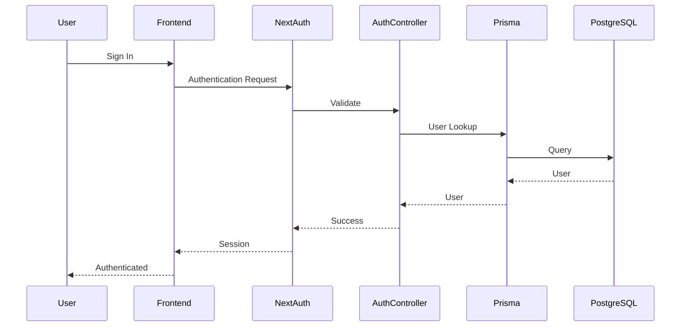

# Authentication Architecture

## Decision Record

| Field                       | Value                                                                                                                                                                 |
| --------------------------- | --------------------------------------------------------------------------------------------------------------------------------------------------------------------- |
| **Status**                  | Accepted                                                                                                                                                              |
| **Decision**                | Implement authentication using NextAuth with Prisma as the persistence layer while isolating authentication from the scraping pipeline and business processing logic. |
| **Date**                    | June 2026                                                                                                                                                             |
| **Owner**                   | JobScraper Architecture                                                                                                                                               |
| **Related Components**      | `auth.ts`, `auth.controller.ts`, `auth-utils.ts`, `SessionProvider.tsx`, Prisma Schema                                                                                |
| **Alternatives Considered** | Custom JWT authentication, Session-based authentication, Third-party authentication services                                                                          |
| **Primary Motivation**      | Provide secure session management while minimizing custom authentication infrastructure and integrating cleanly with the existing relational data model.              |

---

# Summary

Authentication is the only subsystem within JobScraper responsible for user identity and access control.

Unlike the scraping engine, scheduler, or search system, authentication is not concerned with collecting or processing job data.

Its responsibilities are limited to:

* User authentication
* Session management
* Authorization
* Protected routes
* User-specific resources
* Saved jobs

Authentication operates independently from the scraping pipeline, allowing user management to evolve without affecting data collection.

---

# Problem Statement

The majority of JobScraper is publicly accessible.

Searching jobs, browsing listings, and viewing job details require no authentication.

However, certain features require persistent user identity.

Examples include:

* Saving jobs
* Viewing saved jobs
* Managing personal preferences
* Accessing protected endpoints

These capabilities require a reliable authentication system that integrates with the application's relational database.

---

# Background

Authentication represents a fundamentally different workload than job aggregation.

Where scraping focuses on:

* High-volume ingestion
* Search
* Caching

authentication focuses on:

* Identity
* Sessions
* Relationships
* Security

These requirements align well with relational database modeling and ORM abstractions.

As a result, authentication is intentionally implemented using Prisma rather than raw SQL.

---

# Design Goals

The authentication subsystem was designed around several principles.

## Secure Session Management

User identity should persist securely across requests without exposing sensitive information.

---

## Separation of Concerns

Authentication should remain independent from scraping, searching, and processing logic.

---

## Relational Integrity

Users, sessions, and saved jobs should be represented through explicit database relationships.

---

## Minimal Custom Infrastructure

Authentication is a solved problem.

Rather than implementing a custom authentication framework, JobScraper relies on NextAuth for session management and Prisma for persistence.

---

## Extensibility

Future authentication providers and user-specific features should integrate without requiring architectural changes.

---

# Alternatives Considered

## Custom JWT Authentication

Advantages

* Complete control
* Highly customizable

Disadvantages

* Increased security responsibility
* More implementation effort
* Additional maintenance

**Rejected**

---

## Session-Based Authentication

Advantages

* Mature approach
* Strong security

Disadvantages

* Additional infrastructure management

**Partially Adopted**

---

## Third-Party Authentication Service

Advantages

* Reduced implementation effort

Disadvantages

* External dependency
* Vendor lock-in
* Reduced control

**Rejected**

---

## NextAuth + Prisma

Advantages

* Mature ecosystem
* Type-safe integration
* Session management
* Relational persistence
* Minimal custom code

Disadvantages

* Framework-specific abstractions

**Selected**

---

# Selected Design

Authentication is isolated from the remainder of the backend.

```mermaid
flowchart LR

User

-->

Frontend

-->

NextAuth

-->

Auth Controller

-->

Prisma

-->

PostgreSQL
```

The scraping pipeline never interacts with authentication components.

---

# Architecture

Authentication responsibilities are distributed across several components.

```text
Frontend

↓

SessionProvider.tsx

↓

NextAuth

↓

auth.ts

↓

auth.controller.ts

↓

Prisma

↓

PostgreSQL
```

Each component owns a single responsibility.

---

# Why `auth.ts` Exists

`auth.ts` centralizes authentication configuration.

Responsibilities include:

* Authentication providers
* Session configuration
* Callbacks
* Security settings
* Authentication strategy

Keeping configuration isolated prevents authentication logic from spreading across the application.

---

# Why `auth.controller.ts` Exists

The authentication controller forms the boundary between HTTP requests and authentication services.

Responsibilities include:

* Processing authentication requests
* Returning authentication responses
* Coordinating with NextAuth
* Delegating persistence to Prisma

Business rules remain outside the controller.

---

# Why `auth-utils.ts` Exists

Authentication utilities contain reusable helper functions used across the authentication subsystem.

Examples include:

* Session validation
* Authorization helpers
* User lookup helpers
* Shared authentication logic

This prevents duplication throughout the codebase.

---

# Why `SessionProvider.tsx` Exists

The frontend requires awareness of the current authentication state.

`SessionProvider.tsx` exposes authentication context to React components.

Responsibilities include:

* Session availability
* Authentication state
* Protected component rendering
* User context

Business authorization decisions remain on the server.

---

# Authentication Lifecycle

The authentication flow follows a predictable sequence.



---

# Authorization

Authentication answers:

> "Who is the user?"

Authorization answers:

> "What is this user allowed to access?"

JobScraper separates these concerns.

Authentication establishes identity.

Protected routes and backend services enforce authorization rules.

---

# Protected Resources

Authentication is required only for user-specific functionality.

Examples include:

* Saved jobs
* Account management
* Protected API endpoints

Public job browsing remains available without authentication.

This improves accessibility while protecting user-specific data.

---

# Why Prisma Is Used Here

Unlike search queries, authentication primarily consists of relational CRUD operations.

Examples include:

* User lookup
* Session persistence
* Account relationships
* Saved jobs

These operations benefit significantly from Prisma's:

* Type safety
* Relationship management
* Migration tooling
* Developer experience

Raw SQL would provide little additional value for this workload.

---

# Separation from the Scraping Pipeline

Authentication has no interaction with:

* Provider scrapers
* Scheduler
* Job Processor
* Description enrichment
* Semantic deduplication

This separation ensures that user management evolves independently from data ingestion.

---

# Engineering Decisions

## Why NextAuth?

Authentication is a mature problem with well-established solutions.

Leveraging NextAuth reduces custom security code while providing reliable session management.

---

## Why Keep Authentication Separate?

Identity management and scraping solve unrelated problems.

Keeping these systems isolated reduces coupling and simplifies future development.

---

## Why Use Prisma Instead of Raw SQL?

Authentication relies on stable relational models rather than dynamic query generation.

Prisma provides excellent abstractions for this category of workload.

---

## Why Protect Only User-Specific Features?

The primary purpose of JobScraper is public job discovery.

Requiring authentication for browsing would unnecessarily restrict access.

Authentication is therefore reserved for features that require persistent user identity.

---

# Lessons Learned

Authentication proved to be one of the few areas where ORM abstractions consistently improved developer productivity.

Unlike dynamic search queries, authentication operations are highly relational and change infrequently.

Using Prisma here resulted in cleaner code, simpler migrations, and more maintainable relationships.

---

# Trade-offs

Advantages

* Mature authentication ecosystem
* Secure session management
* Excellent relational modeling
* Reduced custom security code
* Clear separation from scraping

Disadvantages

* Additional framework dependency
* Requires understanding of NextAuth abstractions
* Separate authentication lifecycle from the remainder of the backend

These trade-offs were accepted because they significantly reduce authentication complexity while improving maintainability.

---

# Future Improvements

Potential enhancements include:

* OAuth providers
* Email verification
* Password reset flows
* Multi-factor authentication
* User preferences
* Role-based authorization
* Audit logging

The current architecture allows these features to be added without affecting the scraping subsystem.

---

# Related Documentation

This document describes the authentication architecture.

Related documents include:

* Backend Architecture
* Frontend Architecture
* Database Design
* API Reference
* Environment Variables
* Engineering Decision: Prisma vs Raw SQL
