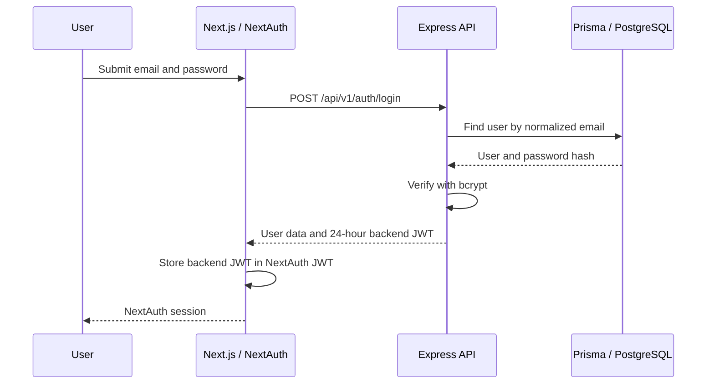

# Authentication Architecture

## Summary

JobScraper uses a two-layer authentication flow:

1. The Express API validates credentials and issues a backend JWT.
2. The Next.js frontend uses NextAuth Credentials to hold that JWT inside its own JWT-backed session.

NextAuth does not query PostgreSQL or Prisma directly. User lookup, password verification, registration, and backend authorization remain responsibilities of the Express API.

## Components

| Component | Responsibility |
| --- | --- |
| `frontend/lib/auth.ts` | Configures NextAuth Credentials, session callbacks, and sign-in behavior. |
| `frontend/app/api/auth/[...nextauth]/route.ts` | Exposes the NextAuth route handlers. |
| `frontend/components/SessionProvider.tsx` | Makes the NextAuth session available to client components. |
| `frontend/lib/auth-utils.ts` | Provides frontend authentication hooks and sign-out behavior. |
| `api/src/controllers/auth.controller.ts` | Registers users, validates credentials, and issues backend JWTs. |
| `api/src/middleware/auth.middleware.ts` | Verifies backend bearer tokens and protects user/admin endpoints. |
| Prisma `User` model | Stores user identity and bcrypt password hashes. |

## Sign-in flow



The backend JWT is exposed to authenticated frontend code as `session.backendToken`. Requests to protected Express endpoints send it as:

```http
Authorization: Bearer <backend-token>
```

## Registration

`POST /api/v1/auth/register`:

- requires `name`, `email`, and `password`;
- normalizes the email to lowercase;
- requires a two-word full name;
- requires a password of at least eight characters;
- hashes the password with bcrypt before persistence;
- returns public user fields without the password hash.

Registration does not automatically create a NextAuth session. The user signs in after registration.

## Session lifetime

Both layers use a 24-hour lifetime:

- the Express API signs backend JWTs with `expiresIn: "24h"`;
- NextAuth uses a JWT session with `maxAge: 24 * 60 * 60`.

Keeping these lifetimes aligned prevents a frontend session from remaining valid after its embedded backend credential has expired. Token refresh is not currently implemented.

## Authorization

### Public endpoints

Job browsing, job details, statistics, registration, login, and health endpoints are public.

### Authenticated user endpoints

The following require a valid backend JWT:

- `GET /api/v1/auth/me`
- all `/api/v1/saved-jobs` endpoints

### Administrative endpoints

All `/api/v1/admin/*` endpoints require:

1. a valid backend JWT; and
2. a token email listed in the comma-separated `ADMIN_EMAILS` environment variable.

If `ADMIN_EMAILS` is empty or the email is not listed, access is denied with `403 Forbidden`. This is an allowlist, not a database-backed role system.

## Secrets

`JWT_SECRET` signs and verifies backend JWTs. `NEXTAUTH_SECRET` signs the frontend NextAuth session. They are independent secrets and must be set explicitly.

The application no longer uses hard-coded fallback secrets:

- backend startup fails when `JWT_SECRET` is missing;
- Docker Compose fails configuration when `JWT_SECRET`, `AUTH_SECRET`, or `ADMIN_EMAILS` is missing.

Do not commit real values. Copy the supplied `.env.example` files and replace every placeholder locally.

## Known limitations

- Credentials authentication has no refresh-token flow.
- Email verification, password reset, multi-factor authentication, and account lockout are not implemented.
- Administrative authorization uses configuration rather than a persisted role model.
- API rate limiting is not implemented.
- Changing `ADMIN_EMAILS` affects new requests immediately, but existing JWTs remain valid for authentication until expiry.

## Related documentation

- [REST API reference](../reference/api.md)
- [Configuration](../reference/configuration.md)
- [Database](../reference/database.md)
- [Architecture overview](overview.md)
