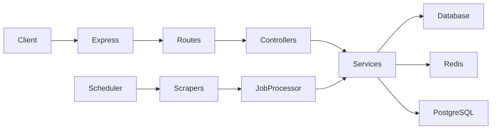
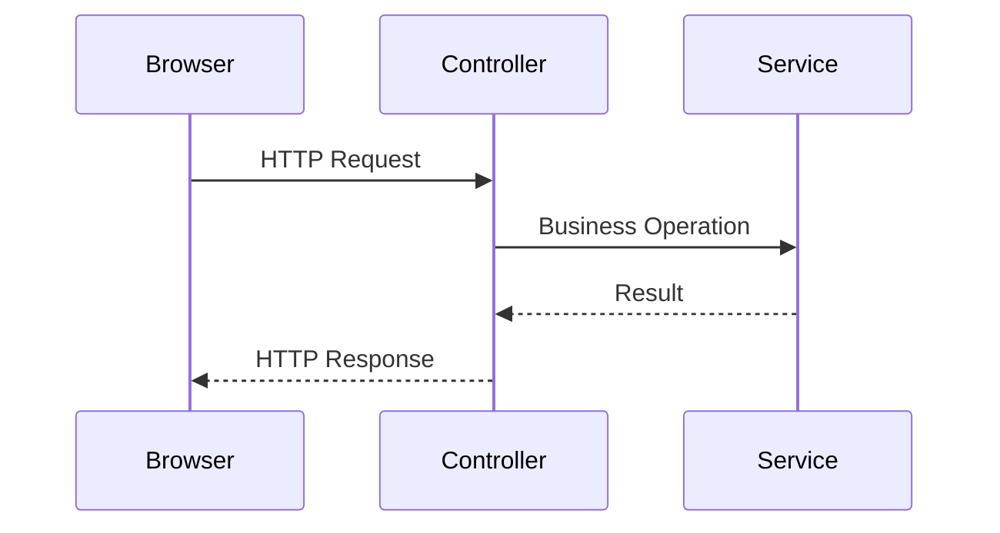

# Backend Architecture

## Summary

The JobScraper backend is a layered TypeScript application built around the principle of **separation of responsibilities**. Each layer owns a single part of the system, allowing scraping, business logic, persistence, caching, and HTTP communication to evolve independently.

Rather than coupling HTTP endpoints directly to the database, every request passes through clearly defined architectural boundaries. Likewise, provider scrapers never communicate directly with persistence layers. All scraped data is processed through a centralized pipeline before it is stored.

This architecture improves maintainability, testability, and extensibility while keeping provider-specific logic isolated from the remainder of the application.

---

# Backend Responsibilities

The backend is responsible for four primary domains.

* Aggregating jobs from external providers
* Processing and validating scraped data
* Serving a unified REST API
* Managing application infrastructure

These responsibilities are intentionally separated into dedicated layers rather than being implemented directly inside controllers or scraper implementations.

---

# Design Goals

The backend architecture was designed around the following objectives.

## Clear Separation of Responsibilities

Each layer performs a single well-defined task.

Examples include:

* Controllers expose HTTP endpoints.
* Services implement business rules.
* Database layers perform persistence.
* Scrapers collect external data.
* The scheduler coordinates scraping.
* Cache modules improve performance.

This separation minimizes coupling and simplifies testing.

---

## Provider Independence

Every supported job provider has unique HTML structures, APIs, and extraction logic.

Provider-specific behavior is isolated within scraper implementations while the remainder of the backend remains provider-agnostic.

As a result, introducing a new provider requires minimal changes outside the scraper itself.

---

## Shared Processing Pipeline

Every scraped job follows the same validation and persistence pipeline.

This guarantees consistent data regardless of its source.

---

## Testability

Business logic is intentionally implemented within services rather than controllers.

This allows the majority of backend behavior to be unit tested without requiring HTTP requests or running the full application.

---

# High-Level Backend Architecture



The backend consists of two major execution paths.

1. **HTTP Request Pipeline**
2. **Scraping Pipeline**

Although these pipelines begin differently, they eventually share common business logic and persistence layers.

---

# Backend Directory Structure

The backend is organized around responsibilities rather than technical frameworks.

```text
api/
├── src/
│
├── controllers/
├── routes/
├── services/
├── lib/
├── cache.ts
├── config.ts
├── container.ts
├── scheduler.ts
├── scrape.ts
├── index.ts
└── app.ts
```

Each directory has a narrowly defined responsibility.

---

# Application Entry Point

The application starts from `index.ts`.

Its responsibilities include:

* Loading environment variables
* Initializing the dependency container
* Connecting to PostgreSQL
* Connecting to Redis
* Starting scheduled tasks
* Starting the Express server

The entry point intentionally contains minimal business logic.

Its sole purpose is application bootstrap.

---

# Express Application

The Express application is configured within `app.ts`.

Typical responsibilities include:

* Middleware registration
* Route registration
* Error handling
* Security middleware
* Request parsing
* HTTP configuration

Keeping server configuration separate from the application entry point simplifies testing and deployment.

---

# Routing Layer

The routing layer maps incoming HTTP requests to controllers.

Example:

```text
GET /jobs
        │
        ▼
Job Route
        │
        ▼
Job Controller
```

Routes contain no business logic.

Their only responsibility is URL definition.

---

# Controller Layer

Controllers form the boundary between HTTP requests and application services.

Responsibilities include:

* Reading request parameters
* Validating request structure
* Calling services
* Returning HTTP responses
* Translating application errors into HTTP status codes

Controllers intentionally remain thin.

They never perform database queries directly.

They never implement business rules.

They never contain scraper logic.

Example request flow:



---

# Service Layer

The service layer contains the majority of the application's business logic.

Typical responsibilities include:

* Search
* Filtering
* Pagination
* Job processing
* Validation
* Deduplication
* Persistence
* Cache coordination

Unlike controllers, services are completely independent of HTTP.

This allows them to be reused by:

* REST endpoints
* Scheduled jobs
* Scraper pipelines
* Unit tests

The service layer represents the core of the backend.

---

# Database Layer

The application intentionally uses two database access strategies.

## Prisma ORM

Prisma is used where relational modeling and developer productivity are most valuable.

Examples include:

* Authentication
* Users
* Saved Jobs
* Migrations

These operations benefit from Prisma's schema management and type safety.

---

## Raw PostgreSQL

Search operations are implemented using raw SQL through the PostgreSQL driver.

Typical operations include:

* Dynamic filtering
* Complex sorting
* Pagination
* Aggregate queries
* Analytics

These queries would become significantly more complex and less efficient if expressed through an ORM.

Separating these concerns provides both developer productivity and query flexibility.

A dedicated document discusses this architectural decision in greater detail.

---

# Caching Layer

Redis acts as the backend caching layer.

Responsibilities include:

* Search result caching
* Frequently accessed data
* Reducing database load
* Improving response latency

The cache is treated as a performance optimization.

PostgreSQL remains the single source of truth.

---

# Scraping Pipeline

The scraping pipeline operates independently from incoming HTTP requests.

Its lifecycle differs significantly from the REST API.

```mermaid
flowchart TD

Scheduler

↓

Provider Scraper

↓

Normalize Jobs

↓

Job Processor

↓

Validation

↓

Deduplication

↓

Enrichment

↓

Persistence

↓

Metrics
```

This separation allows scraping to evolve independently from user-facing API functionality.

---

# Scheduler

The scheduler coordinates scraping operations.

Responsibilities include:

* Executing providers
* Scheduling recurring jobs
* Measuring execution time
* Collecting provider metrics
* Handling failures
* Preventing scheduler crashes

Individual provider failures do not terminate the entire scraping cycle.

---

# Job Processor

The Job Processor is the central orchestration component of the scraping pipeline.

Instead of allowing providers to persist data directly, every extracted listing is processed through a shared validation pipeline.

Responsibilities include:

* Required field validation
* Provider-specific validation
* Remote eligibility checks
* Semantic deduplication
* Description enrichment
* Database persistence
* Metrics collection
* Quality monitoring

Centralizing these responsibilities ensures consistent behavior across every provider.

---

# Dependency Flow

Dependencies always flow inward.

```text
Routes

↓

Controllers

↓

Services

↓

Persistence
```

Lower layers never depend on higher layers.

For example:

* Services know nothing about Express.
* Database modules know nothing about controllers.
* Scrapers know nothing about HTTP routes.

This direction of dependency simplifies maintenance and enables isolated testing.

---

# Error Handling Strategy

Errors are handled at the layer most capable of resolving them.

| Layer       | Responsibility                        |
| ----------- | ------------------------------------- |
| Scrapers    | Provider-specific extraction failures |
| Services    | Business validation                   |
| Controllers | HTTP responses                        |
| Express     | Unhandled exceptions                  |

This prevents infrastructure concerns from leaking into business logic.

---

# Testing Strategy

The backend architecture intentionally favors unit testing.

Most tests target the service layer because it contains the majority of application behavior.

Controllers require relatively little testing due to their limited responsibilities.

Scrapers are tested independently from HTTP.

This architecture minimizes the need for expensive end-to-end tests while maintaining high confidence in application behavior.

---

# Engineering Decisions

## Why Thin Controllers?

Controllers should translate HTTP requests into service calls rather than implement business logic.

Keeping controllers small improves readability, reuse, and testability.

---

## Why Shared Services?

Both HTTP requests and scheduled scraping jobs rely on the same business rules.

Implementing these rules once avoids duplication and guarantees consistent behavior across execution paths.

---

## Why Separate Scrapers from Persistence?

Providers should only know how to extract data.

They should not decide:

* whether a job is valid,
* whether it is a duplicate,
* how it is stored,
* or whether it should be enriched.

Those decisions belong to the processing pipeline.

---

## Why Use Both Prisma and Raw SQL?

Different workloads benefit from different data access strategies.

Prisma excels at relational domain modeling and schema management.

Search workloads require flexible SQL generation, optimized filtering, and performance-oriented queries that are better expressed directly in SQL.

Using both technologies allows each to be applied where it is strongest.

---

# Future Improvements

Potential backend enhancements include:

* Background job queues
* Distributed scraper workers
* Horizontal scheduler scaling
* OpenTelemetry tracing
* Event-driven processing
* Queue-based enrichment
* Full-text search integration
* Elasticsearch support

---

# Related Documentation

This document describes the overall backend architecture.

More detailed discussions are available in:

* Scraper Engine
* Job Processing Pipeline
* Semantic Deduplication
* Description Enrichment
* Search System
* Database Design
* Caching
* Scheduler
* Monitoring
* Deployment
