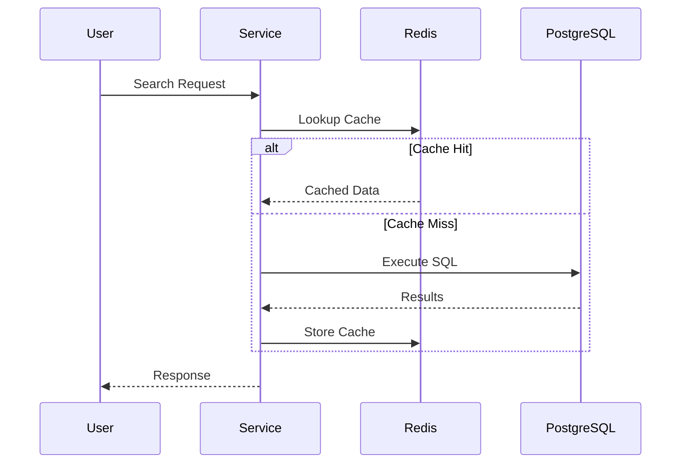

# Caching Strategy

## Decision Record

| Field                       | Value                                                                                                                                |
| --------------------------- | ------------------------------------------------------------------------------------------------------------------------------------ |
| **Status**                  | Accepted                                                                                                                             |
| **Decision**                | Use Redis as a read-through caching layer for frequently requested search data while keeping PostgreSQL as the sole source of truth. |
| **Date**                    | June 2026                                                                                                                            |
| **Owner**                   | JobScraper Architecture                                                                                                              |
| **Related Components**      | `cache.ts`, `job.svc.ts`, PostgreSQL, Search System                                                                                  |
| **Alternatives Considered** | No cache, in-memory cache, Redis cache, CDN caching                                                                                  |
| **Primary Motivation**      | Reduce database load, improve API response times, and maintain predictable cache consistency.                                        |

---

# Summary

JobScraper is a read-heavy application.

Once scraping has completed, the vast majority of requests involve users searching, filtering, and viewing job listings rather than modifying data.

Executing identical database queries for every request would unnecessarily increase PostgreSQL load and response latency.

To improve performance, JobScraper introduces Redis as a dedicated caching layer.

Redis serves only as a performance optimization.

It never replaces PostgreSQL as the authoritative source of application data.

---

# Problem Statement

Search endpoints receive significantly more traffic than write operations.

Examples include:

* Opening the jobs page
* Searching by keyword
* Filtering by location
* Pagination
* Sorting

Many users request the same datasets repeatedly.

Without caching, each request would execute the same SQL query against PostgreSQL.

This creates unnecessary work and reduces scalability.

---

# Background

Although PostgreSQL is highly capable, databases should not repeatedly execute identical queries when the underlying data has not changed.

Caching allows frequently requested results to be served directly from memory, reducing:

* Database CPU usage
* Query latency
* Network overhead
* Overall response time

The challenge is ensuring cached data remains consistent with the database.

---

# Design Goals

The caching layer was designed around several principles.

## PostgreSQL Remains the Source of Truth

Redis never owns persistent data.

If Redis becomes unavailable, the application continues functioning by querying PostgreSQL directly.

---

## Transparent Caching

Controllers remain unaware of caching.

Cache coordination occurs entirely within the service layer.

---

## Automatic Cache Invalidation

Whenever job data changes, affected cache entries should be invalidated automatically.

This prevents stale search results.

---

## Graceful Failure

Redis failures should degrade performance rather than functionality.

If Redis is unavailable, search requests continue using PostgreSQL.

---

## Minimal Operational Complexity

Caching should improve performance without introducing complex synchronization mechanisms.

---

# Alternatives Considered

## No Cache

Advantages

* Simplest implementation

Disadvantages

* Repeated database work
* Higher latency
* Poor scalability

**Rejected**

---

## In-Memory Cache

Advantages

* Extremely fast
* No external dependency

Disadvantages

* Lost on restart
* Not shared across multiple instances
* Difficult to scale horizontally

**Rejected**

---

## CDN Caching

Advantages

* Excellent for static content

Disadvantages

* Search results are dynamic
* User-specific filtering
* Limited invalidation control

**Rejected**

---

## Redis

Advantages

* Shared cache
* Extremely fast
* Mature ecosystem
* Suitable for dynamic application data

Disadvantages

* Additional infrastructure
* Cache invalidation required

**Selected**

---

# Selected Design

Redis sits between the service layer and PostgreSQL.

```mermaid
flowchart LR

Client

↓

JobController

↓

JobService

↓

Redis

↓

PostgreSQL
```

The service layer decides whether data should be retrieved from Redis or PostgreSQL.

Controllers remain unaware of this process.

---

# Cache Architecture

Within the codebase, cache responsibilities are centralized.

```text
src/

cache.ts

↓

Redis Client

↓

job.svc.ts

↓

Search Operations
```

This separation keeps Redis implementation details isolated from the remainder of the application.

---

# Why `cache.ts` Exists

Rather than creating Redis connections throughout the application, JobScraper centralizes Redis initialization inside **`cache.ts`**.

Responsibilities include:

* Redis client initialization
* Connection management
* Error handling
* Graceful shutdown
* Reconnection behavior

Centralizing these concerns prevents connection logic from spreading throughout the codebase.

---

# Cache Lifecycle

A typical search request follows this sequence.



---

# Cache Invalidation

Caching introduces a fundamental challenge.

> How does the application prevent stale data?

JobScraper uses explicit cache invalidation.

Whenever the scraping pipeline inserts or updates jobs:

```text
Database Update

↓

Invalidate Cache

↓

Next Search

↓

Fresh Database Query

↓

Cache Rebuilt
```

This strategy favors consistency over maximum cache lifetime.

---

# Why Explicit Invalidation?

Alternative approaches include:

* Waiting for cache expiration
* Background synchronization
* Periodic refresh

JobScraper instead invalidates affected cache entries immediately after successful writes.

Advantages include:

* Predictable consistency
* Simpler reasoning
* Fresh search results

---

# Failure Handling

Redis is considered an optional performance layer.

If Redis becomes unavailable:

* Search continues
* PostgreSQL serves requests
* No data is lost
* Application functionality remains intact

Only response latency may increase.

This design improves resilience while avoiding unnecessary coupling between Redis and core application logic.

---

# Performance Considerations

The caching strategy improves performance in several ways.

## Reduced Database Load

Frequently requested searches no longer execute identical SQL repeatedly.

---

## Lower Response Times

Memory access is significantly faster than repeated database queries.

---

## Horizontal Scalability

Because Redis is shared, multiple application instances benefit from the same cached data.

---

## Minimal Write Overhead

Writes remain directed to PostgreSQL.

Redis receives updates only through cache invalidation rather than duplicating business logic.

---

# Engineering Decisions

## Why Cache Search Instead of Entire Tables?

Search results represent the application's primary workload.

Caching raw database tables would consume unnecessary memory while providing little benefit.

---

## Why Keep Caching Inside Services?

Controllers should not manage infrastructure concerns.

Services coordinate cache access while exposing a simple business interface to controllers.

---

## Why Treat Redis as Disposable?

Redis improves performance but does not own persistent state.

This allows the application to continue functioning even when Redis is unavailable.

---

# Trade-offs

Advantages

* Faster search responses
* Reduced PostgreSQL load
* Shared cache across instances
* Simple architecture
* Graceful degradation

Disadvantages

* Additional infrastructure
* Cache invalidation complexity
* Extra operational monitoring

These trade-offs were accepted because search performance is one of the application's highest priorities.

---

# Future Improvements

Potential enhancements include:

* Query-specific cache keys
* Adaptive TTL values
* Cache warming after scraping
* Partial cache invalidation
* Distributed cache metrics
* Search popularity tracking

---

# Related Documentation

This document describes the caching architecture.

Related architecture documents include:

* Search System
* Database Design
* Backend Architecture
* Monitoring
* Engineering Decision: Cache Strategy
