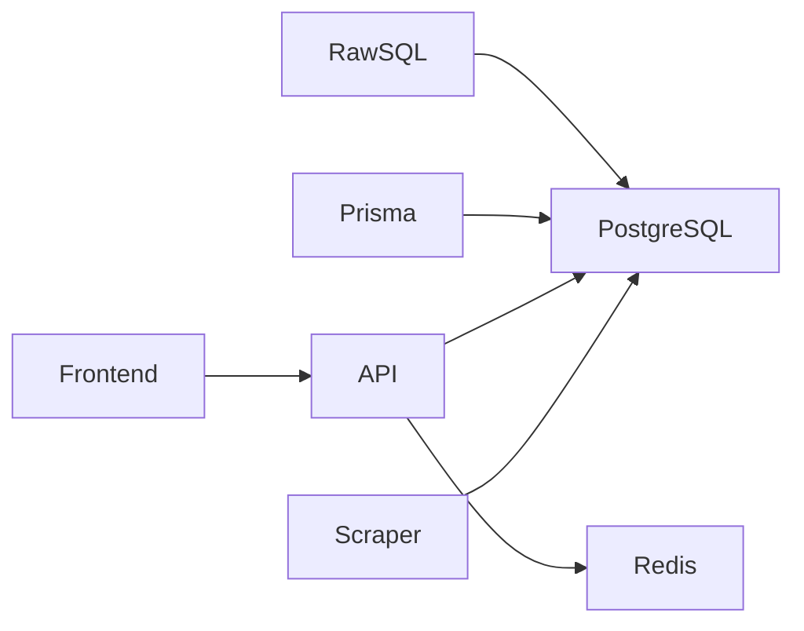

# Database Design

## Decision Record

| Field                       | Value                                                                                                                                       |
| --------------------------- | ------------------------------------------------------------------------------------------------------------------------------------------- |
| **Status**                  | Accepted                                                                                                                                    |
| **Decision**                | Use PostgreSQL as the primary datastore with Prisma ORM for relational domain management and raw SQL (`pg`) for search-intensive workloads. |
| **Date**                    | June 2026                                                                                                                                   |
| **Owner**                   | JobScraper Architecture                                                                                                                     |
| **Related Components**      | Search System, Job Processing Pipeline, Semantic Deduplication, Authentication                                                              |
| **Alternatives Considered** | Full ORM, NoSQL databases, Search-first architecture, Separate search database                                                              |
| **Primary Motivation**      | Maintain relational integrity while optimizing complex search queries and high-volume job ingestion.                                        |

---

# Summary

The database is the central source of truth for JobScraper.

It stores application state, authentication data, user preferences, and normalized job listings collected from external providers.

Unlike traditional CRUD applications, JobScraper must support two very different workloads:

1. **High-volume ingestion** from the scraping pipeline.
2. **Read-heavy search operations** from the frontend.

Because these workloads have different characteristics, the database architecture intentionally combines relational modeling with query optimization rather than relying exclusively on an ORM.

---

# Problem Statement

Job aggregation introduces several database challenges.

Examples include:

* Jobs arriving from multiple providers
* Duplicate listings
* Frequent scraping runs
* Dynamic filtering
* Large search result sets
* Complex sorting
* Pagination
* Authentication data
* User-specific saved jobs

A single data access strategy is not equally effective for all of these workloads.

The database architecture therefore separates **domain modeling** from **search optimization**.

---

# Background

At first glance, an ORM appears sufficient for the entire application.

However, once search requirements become more complex, ORMs often produce verbose queries, limited flexibility, or unnecessary abstraction.

JobScraper therefore separates responsibilities:

* Prisma manages relational entities and schema evolution.
* Raw SQL powers dynamic search queries where explicit control over query construction is beneficial.

This hybrid approach combines developer productivity with predictable query performance.

---

# Design Goals

The database architecture was designed around the following principles.

## Single Source of Truth

All persistent application data resides within PostgreSQL.

Redis is used only as a cache and never replaces the database as the authoritative source of data.

---

## Relational Integrity

Relationships between users, authentication records, and saved jobs should be enforced by the database.

Referential integrity is preferred over application-managed relationships.

---

## Efficient Search

Searching jobs is one of the most common operations performed by the application.

The schema should therefore support:

* Filtering
* Sorting
* Pagination
* Indexed lookups

without requiring expensive post-processing.

---

## Scalable Job Ingestion

The scraping pipeline may process hundreds or thousands of jobs during a scraping cycle.

Insert operations should remain efficient while preventing duplicate records.

---

## Maintainability

Schema evolution should be straightforward.

Database migrations should be version-controlled and reproducible across development and production environments.

---

# Alternatives Considered

## ORM Only

Advantages

* Excellent developer experience
* Strong type safety
* Automatic schema synchronization

Disadvantages

* Dynamic search queries become increasingly complex
* Reduced control over generated SQL
* Harder to optimize query execution

**Partially Adopted**

---

## Raw SQL Everywhere

Advantages

* Maximum flexibility
* Full control over execution plans

Disadvantages

* More boilerplate
* Manual mapping
* Reduced maintainability
* Less productive schema management

**Rejected**

---

## NoSQL Database

Advantages

* Flexible schema
* Horizontal scalability

Disadvantages

* Weak relational modeling
* Poor fit for authentication relationships
* Less efficient for structured filtering and joins

**Rejected**

---

## Dedicated Search Engine

Advantages

* Powerful full-text search
* Advanced ranking

Disadvantages

* Additional infrastructure
* Data synchronization complexity
* Operational overhead

**Deferred**

---

# Selected Design

The final architecture combines multiple approaches.



The database remains the single source of truth while different access patterns are optimized independently.

---

# Logical Data Domains

Rather than thinking in terms of tables, the database is organized into functional domains.

## Job Domain

Stores normalized job listings collected from providers.

Responsibilities include:

* Persistent storage
* Duplicate prevention
* Search
* Analytics

---

## Authentication Domain

Stores user identity and authentication data.

Responsibilities include:

* User accounts
* Sessions
* Authentication providers

This domain is managed entirely through Prisma.

---

## User Domain

Stores user-specific application data.

Examples include:

* Saved jobs
* Preferences
* Future personalization features

---

# Why Jobs Are Normalized

Every provider exposes different metadata.

Without normalization, identical jobs would be stored multiple times under slightly different representations.

Normalization produces consistent values that support:

* Semantic deduplication
* Efficient indexing
* Reliable filtering
* Consistent search results

---

# Semantic Identity

The logical identity of a job is derived from normalized business attributes.

```text
Company

↓

companyKey

+

Position

↓

positionKey

+

Location

↓

locationKey
```

This identity is independent of provider-specific URLs.

The database enforces uniqueness through a composite constraint.

---

# Why PostgreSQL?

PostgreSQL was selected because it provides:

* Mature relational capabilities
* Strong indexing support
* Transactional consistency
* JSON support
* Excellent query optimizer
* Reliable migration tooling

These characteristics align well with both ingestion and search workloads.

---

# Why Prisma?

Prisma is used where relationships and schema management provide the greatest value.

Examples include:

* Authentication
* Users
* Saved jobs
* Migrations

Advantages include:

* Type-safe queries
* Declarative schema
* Migration management
* Excellent developer experience

---

# Why Raw SQL?

Search requirements differ significantly from relational CRUD operations.

Typical search requests combine:

* Optional filters
* Dynamic sorting
* Pagination
* Aggregate information

Constructing these queries directly in SQL provides greater flexibility and clearer optimization opportunities.

Rather than replacing Prisma, raw SQL complements it by addressing a different category of workload.

---

# Indexing Strategy

Indexes are designed around the application's most common access patterns.

Examples include:

* Semantic identity lookups
* Source filtering
* Date-based sorting
* Frequently queried attributes

The objective is to minimize full-table scans while keeping write performance acceptable.

Detailed index definitions are documented in the database schema reference.

---

# Relationships

The database uses relational constraints to maintain consistency.

Typical relationships include:

```text
User

↓

Saved Jobs

↓

Job
```

Delegating relationship management to PostgreSQL reduces application complexity and prevents orphaned records.

---

# Data Lifecycle

Every persisted job follows the same lifecycle.

```mermaid
flowchart TD

Scraper

↓

Normalization

↓

Semantic Keys

↓

Validation

↓

Database Insert

↓

Search

↓

API Response
```

The database is intentionally the final stage of the processing pipeline.

No provider writes directly to persistence.

---

# Engineering Decisions

## Why One Database Instead of Multiple?

Using PostgreSQL as the primary datastore simplifies deployment, backups, migrations, and consistency.

Additional storage technologies should only be introduced when a measurable need exists.

---

## Why Separate Search from Authentication?

Authentication benefits from ORM abstractions.

Search benefits from explicit SQL.

Treating both workloads identically would either reduce flexibility or increase unnecessary complexity.

---

## Why Enforce Constraints in the Database?

Business logic attempts to prevent duplicates, but only database constraints can guarantee consistency under concurrent writes.

The database therefore acts as the final integrity checkpoint.

---

# Performance Considerations

The schema was designed with the following priorities:

* Indexed search paths
* Efficient inserts
* Minimal duplicate checks
* Stable pagination
* Predictable query execution

Normalization also improves index selectivity by reducing inconsistent values.

---

# Trade-offs

Advantages

* Strong relational integrity
* Flexible query optimization
* Efficient search
* Reliable migrations
* Deterministic duplicate prevention

Disadvantages

* Two database access strategies to maintain
* Slightly higher implementation complexity
* Requires developers to understand both Prisma and SQL

These trade-offs were accepted because they provide a better balance between maintainability and performance than either approach alone.

---

# Future Improvements

Potential enhancements include:

* PostgreSQL full-text search
* Materialized views for analytics
* Read replicas
* Partitioning historical job data
* Search engine integration (Elasticsearch/OpenSearch)
* Vector search for semantic matching

These improvements can be introduced incrementally without fundamentally changing the existing schema.

---

# Related Documentation

This document describes the architectural design of the database.

For additional information, see:

* Database Schema Reference
* Search System
* Semantic Deduplication
* Job Processing Pipeline
* Authentication
* Caching
* Engineering Decision: Prisma vs Raw SQL
