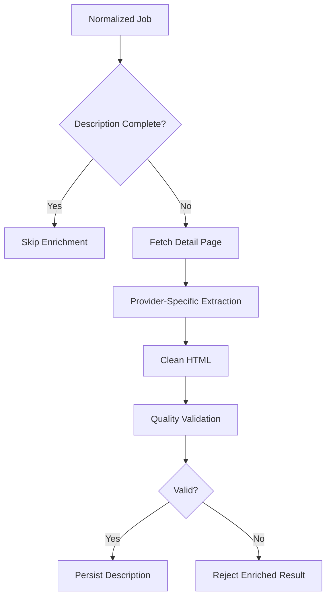

# Description Enrichment

## Decision Record

| Field                       | Value                                                                                                                                  |
| --------------------------- | -------------------------------------------------------------------------------------------------------------------------------------- |
| **Status**                  | Accepted                                                                                                                               |
| **Decision**                | Perform provider-specific description enrichment after validation and semantic deduplication using source-aware extraction strategies. |
| **Date**                    | June 2026                                                                                                                              |
| **Owner**                   | JobScraper Architecture                                                                                                                |
| **Related Components**      | Scraper Engine, Job Processing Pipeline, Database Design                                                                               |
| **Alternatives Considered** | Store listing descriptions, generic HTML extraction, provider-specific extraction, AI-assisted extraction                              |
| **Primary Motivation**      | Improve job description quality while avoiding unnecessary processing and provider-specific extraction failures.                       |

---

# Summary

Most job providers expose incomplete information on listing pages.

Typical listing pages contain only a short preview intended to encourage users to visit the provider's website.

For a job aggregation platform, these previews provide an inadequate search experience.

JobScraper addresses this problem through a dedicated **Description Enrichment Pipeline**.

Rather than persisting incomplete descriptions, the system optionally retrieves additional information from provider-specific detail pages, validates the extracted content, removes irrelevant HTML, and stores a cleaned description.

The enrichment system is intentionally isolated from provider scraping and persistence so that extraction strategies can evolve independently.

---

# Problem Statement

Job descriptions collected directly from listing pages suffer from several problems.

Examples include:

* Truncated descriptions
* Marketing snippets
* Navigation content
* Authentication prompts
* Empty placeholders
* HTML artifacts
* Provider-specific formatting
* Missing responsibilities

Persisting these descriptions directly would reduce search quality and provide a poor user experience.

---

# Background

Not every provider exposes the same level of detail.

Some providers publish complete descriptions through public APIs or RSS feeds.

Others expose only a short excerpt and require a second request to retrieve the full content.

Treating all providers identically would either:

* perform unnecessary work for providers that already expose complete descriptions, or
* produce incomplete data for providers that do not.

The enrichment system was therefore designed to make enrichment **conditional** rather than mandatory.

---

# Design Goals

The enrichment system was designed around the following principles.

## Improve Data Quality

Descriptions should contain enough information to understand the role without visiting the original provider.

---

## Avoid Unnecessary Requests

If a provider already supplies a high-quality description, enrichment should be skipped.

This reduces processing time and network traffic.

---

## Provider Independence

Although each provider requires different extraction strategies, the remainder of the application should not depend on those differences.

---

## Fault Tolerance

Failure to enrich a description should never terminate a scraping run.

Individual failures are recorded while the remainder of the pipeline continues processing.

---

## Measurable Quality

Every enrichment attempt should produce operational metrics.

This allows extraction quality to be monitored over time and simplifies debugging when providers change their HTML.

---

# Alternatives Considered

## Store Listing Descriptions

Advantages

* No additional requests
* Very fast

Disadvantages

* Poor search quality
* Missing responsibilities
* Truncated descriptions

**Rejected**

---

## Generic HTML Extraction

Advantages

* Single implementation
* Minimal provider-specific code

Disadvantages

* Highly sensitive to HTML differences
* Frequently captures navigation, sidebars, and unrelated content

**Rejected**

---

## Provider-Specific Extraction

Advantages

* Higher extraction accuracy
* Better resilience
* Cleaner descriptions

Disadvantages

* Requires provider-specific maintenance

**Selected**

---

## AI-Assisted Extraction

Advantages

* Flexible
* Potentially robust against HTML changes

Disadvantages

* Increased latency
* Higher infrastructure cost
* Additional operational complexity

**Deferred**

---

# Selected Design

The enrichment system performs additional extraction only when required.

This minimizes unnecessary work while ensuring incomplete descriptions are improved whenever possible.

---

# Why Enrichment Happens After Deduplication

Description enrichment is one of the most expensive operations in the processing pipeline.

It may require:

* Additional HTTP requests
* Browser navigation
* HTML parsing
* DOM traversal
* Text cleanup

Performing these operations before duplicate detection would waste resources on jobs that will never be stored.

Running enrichment after semantic deduplication ensures that only candidate records requiring persistence incur this cost.

---

# Provider-Specific Extraction

Every provider structures its detail pages differently.

Examples of differences include:

* HTML hierarchy
* CSS class names
* Embedded metadata
* Rich text formatting
* Dynamic rendering

Instead of attempting to create a universal extractor, JobScraper delegates extraction to provider-specific strategies.

The remainder of the pipeline receives normalized text regardless of how it was obtained.

---

# Content Cleaning

Raw HTML often contains elements that are not part of the actual job description.

Typical examples include:

* Navigation menus
* Footer content
* Related jobs
* Social sharing buttons
* Cookie notices
* Advertisement sections

The enrichment pipeline removes these elements before the description is evaluated.

The objective is to preserve only the content describing the position itself.

---

# Quality Validation

Successful extraction does not necessarily produce usable content.

Every enriched description is evaluated before persistence.

Typical validation includes:

* Minimum content length
* Detection of empty descriptions
* Removal of HTML artifacts
* Rejection of navigation-only pages
* Rejection of authentication pages
* Structural validation

Descriptions that fail these checks are discarded rather than persisted.

This prevents low-quality content from entering the database.

---

# Failure Handling

Enrichment failures are treated as expected operational events.

Common causes include:

* Provider HTML changes
* Network failures
* Missing detail pages
* Invalid selectors
* Temporary outages

Failures are isolated to the individual job being processed.

The remainder of the scraping run continues unaffected.

---

# Observability

Every enrichment attempt contributes operational metrics.

Examples include:

* Enrichment attempts
* Successful enrichments
* Failed enrichments
* Average description length
* Extraction warnings
* Provider-specific failures

These metrics make it easier to detect provider regressions before they significantly impact data quality.

---

# Engineering Decisions

## Why Separate Enrichment from Scraping?

Scrapers should focus on collecting data.

The enrichment system focuses on improving data quality.

Separating these concerns allows extraction strategies to evolve independently from provider navigation.

---

## Why Use Provider-Specific Strategies?

HTML published by different providers varies significantly.

Provider-specific extraction produces more reliable results than attempting to apply a single generic strategy to every website.

---

## Why Validate Enriched Content?

Successfully extracting text does not guarantee that the extracted text represents a usable job description.

Quality validation protects the database from low-value or incorrect content.

---

## Why Skip Enrichment When Possible?

Some providers already expose complete descriptions.

Avoiding unnecessary enrichment reduces processing time and improves overall pipeline throughput.

---

# Trade-offs

Advantages

* Higher-quality descriptions
* Better search experience
* Cleaner database
* Provider-specific optimization
* Better operational visibility

Disadvantages

* Additional HTTP requests
* Provider maintenance overhead
* Increased implementation complexity
* Dependency on provider HTML stability

These trade-offs were accepted because the resulting improvement in data quality significantly outweighs the additional complexity.

---

# Future Improvements

Potential enhancements include:

* Automatic selector health monitoring
* Machine-learning-assisted content validation
* LLM-assisted extraction fallback
* Adaptive extraction strategies
* Confidence scoring
* Incremental enrichment
* Distributed enrichment workers

---

# Related Documentation

This document focuses on description quality.

Related architecture documents include:

* Scraper Engine
* Job Processing Pipeline
* Semantic Deduplication
* Database Design
* Monitoring
* Scheduler
