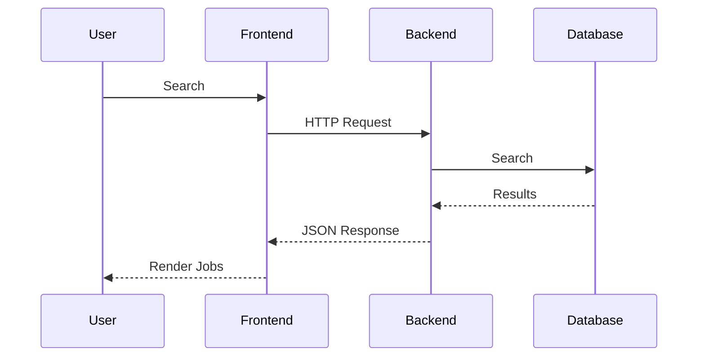

# Frontend Architecture

## Decision Record

| Field                       | Value                                                                                                                            |
| --------------------------- | -------------------------------------------------------------------------------------------------------------------------------- |
| **Status**                  | Accepted                                                                                                                         |
| **Decision**                | Build the frontend as a thin client using Next.js App Router, consuming backend APIs while keeping business logic on the server. |
| **Date**                    | June 2026                                                                                                                        |
| **Owner**                   | JobScraper Architecture                                                                                                          |
| **Related Components**      | `app/`, `components/`, `lib/`, Backend API                                                                                       |
| **Alternatives Considered** | Backend-driven rendering, SPA-only architecture, Server Components only, Hybrid rendering                                        |
| **Primary Motivation**      | Maintain a clean separation between presentation and business logic while providing a modern, responsive user experience.        |

---

# Summary

The JobScraper frontend is responsible for presenting data retrieved from the backend.

Unlike the backend, the frontend does not participate in scraping, validation, enrichment, semantic deduplication, or database persistence.

Its responsibilities are intentionally limited to:

* Rendering user interfaces
* Managing navigation
* Handling authentication state
* Collecting user input
* Communicating with the backend API
* Presenting search results

By keeping the frontend focused on presentation, the backend remains the single location where business rules are implemented.

---

# Problem Statement

Modern web applications frequently accumulate business logic inside the client.

Examples include:

* Validation rules
* Data transformation
* Filtering logic
* Authorization decisions
* State synchronization

As applications grow, this often leads to duplicated logic across the frontend and backend.

JobScraper intentionally avoids this architecture.

The frontend delegates business decisions to the backend and focuses exclusively on user interaction.

---

# Background

JobScraper consists of two independently evolving applications.

```mermaid
flowchart LR

Frontend

<-->

REST API

<-->

Backend
```

The frontend communicates exclusively through the public API.

It has no direct access to:

* PostgreSQL
* Redis
* Scrapers
* Job Processor
* Scheduler

This separation allows backend systems to evolve without requiring frontend changes.

---

# Design Goals

The frontend was designed around several principles.

## Thin Client

Business rules belong in the backend.

The frontend should remain responsible only for presentation and interaction.

---

## Component Reusability

UI elements should be reusable across multiple pages.

Components should encapsulate presentation rather than application logic.

---

## Clear Routing

Application routing should follow Next.js App Router conventions.

Routes should map naturally to user-facing pages.

---

## Responsive Experience

The interface should remain responsive across desktop and mobile devices.

---

## Maintainability

UI structure should remain easy to navigate as new features are introduced.

---

# Alternatives Considered

## Monolithic Frontend

Advantages

* Centralized client logic

Disadvantages

* Business logic duplication
* Difficult maintenance

**Rejected**

---

## Backend-Rendered Templates

Advantages

* Simple architecture

Disadvantages

* Reduced interactivity
* Limited client experience

**Rejected**

---

## SPA Only

Advantages

* Highly interactive

Disadvantages

* Larger client bundles
* Reduced server-rendering benefits

**Rejected**

---

## Next.js Hybrid Architecture

Advantages

* Server rendering where appropriate
* Client interactivity where required
* Flexible routing
* Modern React architecture

Disadvantages

* Slightly more architectural complexity

**Selected**

---

# Selected Design

The frontend is organized into layers.

```mermaid
flowchart TD

Pages

↓

Components

↓

API Layer

↓

Backend
```

Each layer owns a specific responsibility.

---

# Application Structure

The application follows a feature-oriented organization.

Typical structure:

```text
app/
components/
lib/
hooks/
types/
```

Each directory serves a distinct purpose.

---

# Why `app/` Exists

The `app/` directory defines the application's routing structure.

Responsibilities include:

* Page composition
* Layout definition
* Route organization
* Navigation hierarchy

Business logic is intentionally absent.

---

# Why `components/` Exists

Reusable UI elements are placed within the component layer.

Typical examples include:

* Job cards
* Search interface
* Filter panels
* Navigation
* Authentication components

Components are designed to maximize reuse while minimizing duplicated UI code.

---

# Why API Communication Is Centralized

Rather than scattering HTTP requests throughout the application, communication with the backend is centralized.

Advantages include:

* Consistent request handling
* Easier maintenance
* Shared error handling
* Simplified testing

---

# Request Lifecycle

A typical user search follows this sequence.



The frontend remains unaware of how the backend produces these results.

---

# State Management

The frontend manages only client-specific state.

Examples include:

* Search form values
* Filter selections
* Loading states
* Pagination state
* Authentication session

Persistent business data remains on the backend.

---

# Authentication Integration

Authentication is delegated to the backend and NextAuth.

The frontend primarily manages:

* Sign-in flow
* Session awareness
* Protected routes
* Conditional rendering

Authorization decisions remain server-side.

---

# Rendering Strategy

JobScraper uses Next.js capabilities to balance performance and interactivity.

Rendering decisions are based on the requirements of each page rather than applying a single strategy universally.

This approach keeps the application responsive while avoiding unnecessary client-side work.

---

# Engineering Decisions

## Why Keep the Frontend Thin?

Duplicating business logic across client and server increases maintenance costs and introduces opportunities for inconsistent behavior.

Keeping business rules exclusively in the backend ensures every client receives consistent behavior.

---

## Why Use Components Instead of Large Pages?

Reusable components reduce duplication and make UI maintenance significantly easier as the application grows.

---

## Why Consume Only the REST API?

The frontend communicates exclusively through the public API.

This allows backend implementation details—including database schema, scraping logic, and caching—to evolve without affecting the UI.

---

# Lessons Learned

As the project evolved, more functionality moved into the backend.

Features such as semantic deduplication, enrichment, validation, and search optimization required no frontend changes because the client already depended only on the API contract.

This reinforced the value of maintaining a thin client architecture.

---

# Trade-offs

Advantages

* Clear separation of concerns
* Reusable UI components
* Easier backend evolution
* Reduced client complexity
* Improved maintainability

Disadvantages

* Greater reliance on backend APIs
* Some interactions require additional network requests
* Less client-side autonomy

These trade-offs were accepted because they align with the project's goal of demonstrating robust backend engineering.

---

# Future Improvements

Potential enhancements include:

* Infinite scrolling
* Optimistic UI updates
* Offline support
* Search suggestions
* Accessibility improvements
* Theme customization
* Progressive Web App capabilities

---

# Related Documentation

This document describes the frontend architecture.

Related documents include:

* Backend Architecture
* Authentication
* Search System
* Caching
* Monitoring
* API Reference
