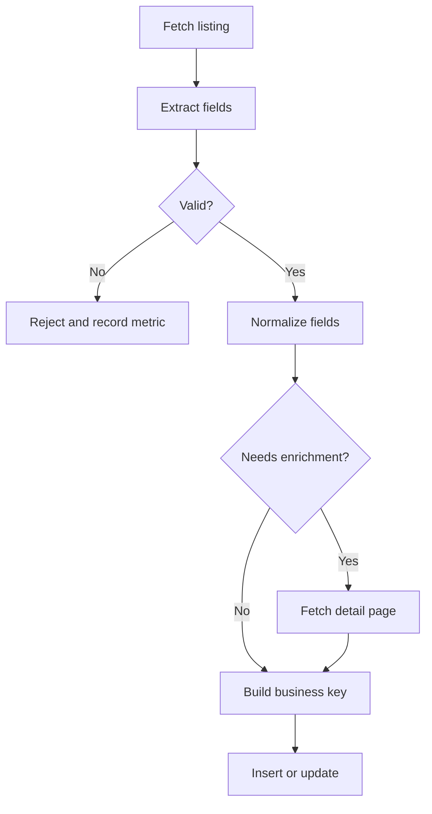

# Ingestion and data quality

The ingestion system turns inconsistent job-board pages into records that can be
searched and updated predictably. Scraping is only the first step; most of the
engineering value is in deciding what data is valid, how identity is determined,
and when source text can be trusted.

## Pipeline



The main implementation is split between:

- `api/src/scrape.ts`: provider adapters, registration, and run orchestration.
- `api/src/services/job.processor.ts`: validation, normalization, enrichment,
  and processing metrics.
- `api/src/services/job.svc.ts`: persistence behavior.
- `api/prisma/schema.prisma`: database-level uniqueness.

## Provider adapters

Each provider adapter converts source-specific markup or responses into the
shared job shape. `ScraperManager.getScrapeJobs()` is the registry used by a full
run. NoDesk is behind `ENABLE_EXPERIMENTAL_SOURCES`; it is excluded by default
because experimental sources should not silently become production
dependencies.

The provider boundary owns selectors, pagination rules, source naming, and
source URLs. It should not redefine global identity or validation rules.

To add a source, follow [Adding a provider](../guides/adding-a-provider.md).

## Execution model

`runAll()` executes registered providers sequentially and isolates errors by
provider. `runOne()` targets one registered source. Sequential execution is a
deliberate resource-control choice: several providers may use browser automation,
and opening them all at once can exhaust memory or browser capacity.

The API process also registers a daily schedule for 02:00 in the process
timezone. An in-memory lock prevents overlapping runs in that process.

This does **not** provide:

- durable job execution;
- retries that survive a process restart;
- coordination across multiple API replicas;
- a guaranteed once-only run.

A production deployment with multiple replicas should use a distributed
scheduler or queue.

## Validation

The processor rejects records that cannot support the product's core use case.
Required structural fields include a usable title, company, location, source,
and application URL. URL checks and field-length checks prevent malformed
records from reaching persistence.

Validation is intentionally earlier than deduplication. A malformed listing
should not participate in identity decisions or overwrite a valid record.

## Normalization

Normalization reduces superficial source differences before data is compared:

- company and position participate in identity using lowercase values;
- remote-location variants are mapped to a canonical representation;
- text is trimmed and cleaned;
- description wrappers and obvious navigation noise are removed.

Normalization is conservative. It does not attempt to infer that two different
company names or job titles are semantically equivalent. That would create
false-positive merges that are difficult to reverse.

## Description quality

Listing descriptions range from complete role text to a short teaser, an
authentication wall, or an entire page wrapper. The processor therefore applies
source-aware policies:

1. assess whether listing text is already usable;
2. fetch a detail page only where the provider policy permits it;
3. remove known noise and reject auth-wall text;
4. retain the best usable description available.

Enrichment is not universally safe. Some application URLs lead to third-party
forms or blocked pages, so a failed fetch must not erase usable listing text.

See [Description quality](../engineering-notes/description-quality.md).

## Deterministic identity

The stable business key is:

```text
lowercase(company) + lowercase(position) + normalized(location)
```

The same identity rule is enforced in processing and represented by a composite
unique constraint in PostgreSQL. Listing URLs are stored as attributes, not
identity, because providers can rotate tracking parameters or publish the same
role under multiple URLs.

When the key already exists, persistence updates the record rather than
inserting a duplicate. A richer incoming description may improve the existing
record.

This rule is explainable and testable, but not magical:

- distinct openings with identical company, title, and location may collapse;
- spelling differences can remain separate;
- remote and hybrid wording requires careful normalization;
- the system does not currently resolve company aliases.

See [Deterministic deduplication](../decisions/0002-deterministic-deduplication.md)
and [Cross-source deduplication](../engineering-notes/cross-source-deduplication.md).

## Persistence and retries

Prisma manages the schema and ordinary model access. Writes rely on database
uniqueness as the final concurrency boundary. Database connection failures use
bounded retry behavior; retries are not a substitute for an unavailable
database, and validation errors should not be retried.

The processor reports counts for accepted, rejected, inserted, updated, and
enrichment outcomes. These metrics are useful for detecting a selector change
or sudden quality regression, but they are process-local logs rather than a
durable observability system.

## Triggering ingestion

| Entry point | Intended use | Security or operational note |
|---|---|---|
| CLI | Development and one-off operations | Uses local environment credentials |
| Daily scheduler | Routine single-process deployment | Process timezone; in-memory lock |
| Admin API | Controlled operational action | JWT plus `ADMIN_EMAILS` membership |

Exact routes and payloads are in the [API reference](../reference/api.md).

## Verification

The automated suite covers processor behavior, deduplication, enrichment
fallbacks, provider isolation, authentication, and route protection. When
changing ingestion behavior, run:

```bash
cd api
npm test
npm run build
```

Provider selectors still require a live smoke test because fixtures cannot prove
that a third-party page has not changed. Follow
[Testing and debugging](../guides/testing-and-debugging.md).
