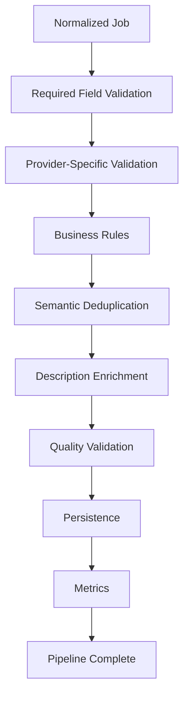
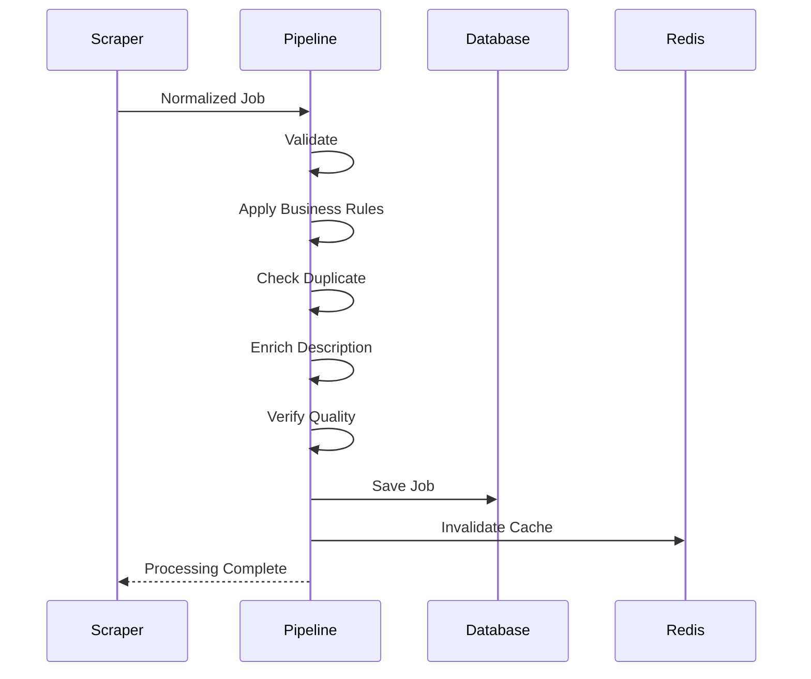

# Job Processing Pipeline

## Summary

The Job Processing Pipeline is the core orchestration layer of JobScraper.

Every job collected by a provider passes through this pipeline before it is persisted. Rather than storing raw scraped data immediately, the pipeline performs a sequence of validation, normalization, enrichment, and quality assurance stages to ensure that only high-quality job listings become searchable.

The pipeline provides a consistent processing model for every provider, regardless of how the original data was collected.

By centralizing business rules into a single processing workflow, JobScraper guarantees that every job is evaluated against the same quality standards.

---

# Purpose

Public job providers expose data with widely varying quality.

Common issues include:

* Missing descriptions
* Duplicate listings
* Inconsistent company names
* Different location formats
* Missing metadata
* Incomplete salary information
* HTML artifacts
* Provider-specific formatting

Persisting these records directly would produce an inconsistent database and a poor search experience.

The purpose of the Job Processing Pipeline is to transform unreliable external data into a standardized, searchable dataset.

---

# Design Goals

The pipeline was designed around five primary goals.

## Data Quality

The pipeline prioritizes high-quality job listings over storing every scraped result.

Rejecting low-quality data is preferable to exposing unreliable information to users.

---

## Consistency

Every provider should produce jobs that follow identical validation rules.

Regardless of whether a job originated from an API, RSS feed, or HTML page, it must satisfy the same quality requirements.

---

## Single Source of Business Logic

Validation, deduplication, enrichment, and persistence are implemented once.

Provider implementations do not duplicate business rules.

---

## Extensibility

New processing stages should be introduced without requiring changes to provider implementations.

This keeps the architecture modular as additional features are added.

---

## Observability

Every stage should produce metrics that explain:

* accepted jobs
* rejected jobs
* enrichment success
* duplicate detection
* processing failures
* provider health

The pipeline therefore acts as both a processing engine and an operational monitoring system.

---

# Processing Overview

Every job follows the same lifecycle.



The order of these stages is intentional.

Each stage reduces unnecessary work for the stages that follow.

---

# Why Processing Happens in Stages

A common question is:

> Why not perform all validation at once?

Separating processing into stages provides several advantages.

* Early failures prevent unnecessary computation.
* Expensive operations only execute when required.
* Each stage has a clearly defined responsibility.
* Metrics can identify where jobs are being rejected.
* Individual stages can evolve independently.

For example, there is no reason to perform expensive description enrichment on a job that has already failed basic validation.

---

# Stage 1 — Required Field Validation

The first stage verifies that the minimum information required for processing is available.

Typical requirements include:

* Company
* Position
* Source
* URL
* Location

Jobs missing critical fields are rejected immediately.

## Why This Happens First

Required field validation is extremely inexpensive.

Rejecting obviously invalid jobs before performing additional work minimizes unnecessary processing.

---

# Stage 2 — Provider Validation

Some providers require additional validation because of differences in the data they expose.

Examples include:

* incomplete metadata
* malformed URLs
* provider-specific extraction failures

Provider-specific validation is isolated to this stage so that later stages remain provider-independent.

---

# Stage 3 — Business Rules

After structural validation, the pipeline evaluates business rules.

Examples include:

* supported locations
* remote requirements
* acceptable job categories
* filtering unsupported listings

Business rules represent application policy rather than provider correctness.

Separating these concerns simplifies future modifications.

---

# Stage 4 — Semantic Deduplication

Once a job has passed validation, the pipeline determines whether it already exists.

Rather than comparing URLs, JobScraper compares normalized business attributes.

```text
Company

↓

Position

↓

Location
```

This allows duplicate jobs from different providers to be detected even when their URLs differ completely.

Semantic deduplication is documented separately.

---

# Why Deduplication Happens Before Enrichment

Description enrichment is one of the most expensive operations in the pipeline.

Running enrichment before duplicate detection would waste processing time on jobs that will never be stored.

By deduplicating first, the pipeline minimizes unnecessary network requests.

---

# Stage 5 — Description Enrichment

Many providers expose only short previews on listing pages.

When necessary, the pipeline performs additional extraction from the job detail page to improve data quality.

Typical improvements include:

* complete descriptions
* cleaned formatting
* normalized text
* removal of navigation content

Enrichment only executes when required.

The pipeline avoids unnecessary requests when an acceptable description already exists.

---

# Stage 6 — Quality Validation

Enrichment may still produce poor results.

Examples include:

* authentication pages
* navigation wrappers
* empty descriptions
* truncated content
* malformed HTML

The quality validation stage verifies that enriched content satisfies minimum quality requirements before persistence.

This prevents unusable descriptions from entering the database.

---

# Stage 7 — Persistence

Only after every previous stage succeeds is the job persisted.

Responsibilities include:

* database insertion
* duplicate updates
* timestamps
* cache invalidation

Persistence is intentionally the final stage of the pipeline.

---

# Stage 8 — Metrics Collection

The pipeline records operational information for every provider.

Typical metrics include:

* jobs discovered
* accepted jobs
* rejected jobs
* duplicates
* enrichment success
* processing duration
* warnings
* failure counts

These metrics support both monitoring and debugging.

---

# Pipeline Sequence

The following sequence illustrates the interaction between the primary components.



---

# Failure Handling

Failure is expected throughout the pipeline.

Individual jobs may fail at any stage without affecting the remainder of the processing batch.

Typical failures include:

* missing metadata
* duplicate jobs
* enrichment failures
* invalid descriptions
* provider inconsistencies

The pipeline records these failures while continuing to process subsequent jobs.

This approach improves resilience and prevents isolated failures from interrupting entire scraping runs.

---

# Why Centralize Processing?

An alternative architecture would allow every provider to implement its own validation and persistence logic.

This approach was intentionally avoided.

Centralizing processing provides several advantages:

* consistent quality standards
* reusable business rules
* simplified maintenance
* easier testing
* uniform metrics
* predictable behavior

Every provider benefits from improvements made to the pipeline without requiring provider-specific changes.

---

# Engineering Decisions

## Why Process Jobs Sequentially?

Each stage depends on the output of the previous stage.

Maintaining a deterministic processing order simplifies reasoning, debugging, and testing.

---

## Why Separate Validation from Business Rules?

Validation answers:

> "Is this data structurally usable?"

Business rules answer:

> "Should this application accept this job?"

Separating these concerns improves maintainability and avoids mixing technical correctness with product policy.

---

## Why Perform Enrichment Late?

Enrichment is one of the most expensive operations in the pipeline.

Executing it only after validation and deduplication minimizes unnecessary work.

---

## Why Collect Metrics During Processing?

Operational metrics provide visibility into provider quality and pipeline health.

Without these metrics, identifying regressions or extraction failures would be significantly more difficult.

---

# Trade-offs

Advantages:

* Consistent processing
* High-quality data
* Reusable business rules
* Provider independence
* Excellent observability

Disadvantages:

* Longer processing time per job
* More architectural components
* Greater implementation complexity

These trade-offs were accepted because they produce a significantly cleaner and more maintainable system.

---

# Future Improvements

Potential enhancements include:

* Parallel pipeline stages where dependencies allow
* Queue-based enrichment workers
* AI-assisted quality scoring
* Confidence-based validation
* Retry queues for transient failures
* Event-driven processing

---

# Related Documentation

This document describes the overall processing workflow.

The individual processing stages are documented separately:

* Scraper Engine
* Semantic Deduplication
* Description Enrichment
* Database Design
* Monitoring
* Scheduler
