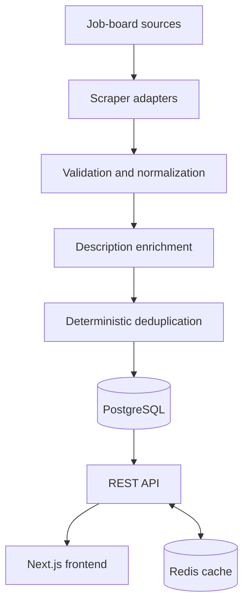

# Architecture overview

Job Scraper is a two-application TypeScript system backed by PostgreSQL and
Redis:

- `api/` collects, normalizes, stores, and serves jobs.
- `frontend/` provides public search and authenticated saved-job features.
- PostgreSQL is the system of record.
- Redis is a disposable cache, not a second database. The current API bootstrap
  still requires a successful Redis connection before listening for requests.

The system is best understood as a data-quality pipeline rather than a set of
independent web crawlers.

## Runtime boundaries

| Boundary | Responsibility | Important paths |
|---|---|---|
| Scraping | Fetch and parse source-specific listings | `api/src/scrape.ts` |
| Processing | Validate, normalize, enrich, and measure job quality | `api/src/services/job.processor.ts` |
| Persistence | Apply the stable business key and write jobs | `api/src/services/job.svc.ts`, `api/prisma/schema.prisma` |
| Query API | Search, filter, paginate, and return job data | `api/src/controllers/`, `api/src/lib/job.sql.ts` |
| Authentication | Issue and verify JWTs; protect user and admin actions | `api/src/controllers/auth.controller.ts`, `api/src/middleware/auth.middleware.ts` |
| Web client | Render search, details, statistics, and saved jobs | `frontend/app/`, `frontend/lib/` |

## Ingestion path

Provider adapters return a common job shape. The processor rejects structurally
invalid records, standardizes fields such as location, removes obvious page
chrome from descriptions, and enriches weak descriptions when a source policy
allows it. Persistence uses a composite business key—not a listing URL—to decide
whether a record is new or an update.

Scrapers run sequentially. This limits browser pressure and isolates provider
failures. A daily in-process scheduler starts the pipeline at 02:00 in the
server's local timezone; operators can also run it from the CLI or through the
protected admin endpoint.

See [Ingestion and data quality](ingestion-and-data-quality.md).

## Read path

The API exposes public job, search, statistics, health, and authentication
routes. Saved-job routes require a valid user token. Scraper administration
requires both a valid token and membership in the `ADMIN_EMAILS` allowlist.

Search uses parameterized PostgreSQL queries because its optional filters,
case-insensitive matching, ordering, and pagination are clearer as explicit SQL
than as deeply dynamic ORM expressions. Common reads use cache-aside Redis
entries with short TTLs. After a successful startup, cache read/write failures
fall back to PostgreSQL or become no-ops. The current bootstrap is stricter:
failure to establish the initial Redis connection stops the API.

See [Search and caching](search-and-caching.md) and
[Authentication](authentication.md).

## Data model

The schema has four models:

- `Job` for normalized listings.
- `User` for accounts.
- `SavedJob` for the user-to-job relation.
- `ScrapeLog` for provider-run outcomes.

The job uniqueness constraint covers normalized company, position, and
location. PostgreSQL owns durable state; Prisma supplies schema management and
ordinary CRUD, while carefully parameterized SQL handles search.

See [Database reference](../reference/database.md).

## Failure boundaries

- One provider failure is logged and does not stop later providers.
- Invalid jobs are rejected before persistence.
- Description enrichment may fall back to listing text.
- Database connection attempts use bounded retry behavior.
- Redis operation failures after startup fall back to PostgreSQL; initial Redis
  connection failure is fatal to the API process.
- The scheduler lock prevents overlapping runs only inside one API process.

The current scheduler is not a distributed queue, scraper execution has no
durable checkpoint, and source HTML can change without notice. Those are
explicit limitations rather than hidden capabilities.

## Design principles

1. Normalize before deciding identity.
2. Keep source-specific rules at the ingestion boundary.
3. Treat the database as the authority.
4. Make cache loss harmless.
5. Protect operational controls separately from ordinary user features.
6. Document verified behavior, not intended behavior.

## Related documentation

- [Project case study](../case-study.md)
- [Local development](../guides/local-development.md)
- [API reference](../reference/api.md)
- [Configuration reference](../reference/configuration.md)
- [Architecture decisions](../decisions/0001-prisma-and-raw-sql.md)
