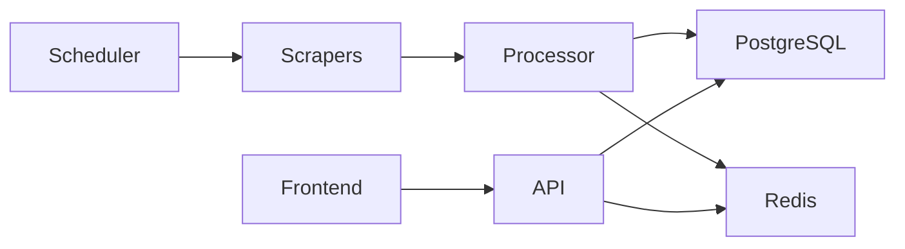
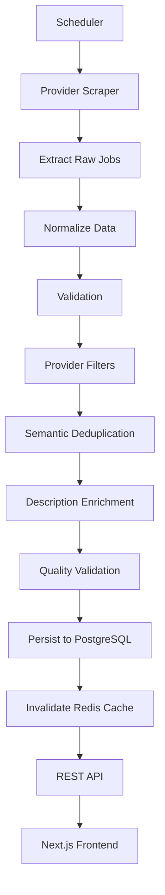
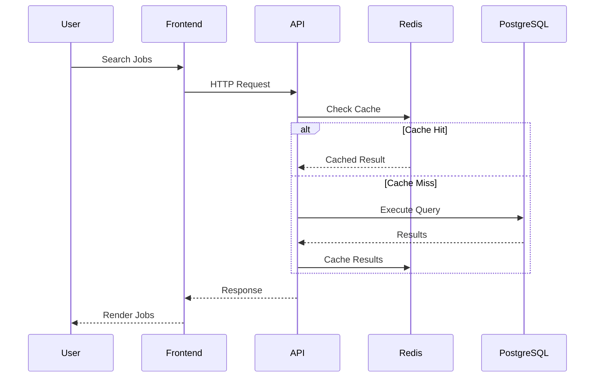

# Architecture Overview

## Summary

JobScraper is a production-oriented job aggregation platform that collects remote software engineering jobs from multiple providers, processes them through a quality-focused data pipeline, and exposes them through a unified search interface.

Unlike traditional web scrapers that simply store extracted HTML, JobScraper treats scraping as a data engineering problem. Every job listing passes through multiple validation and processing stages before it becomes available to end users.

The architecture emphasizes the following principles:

* Provider independence
* Data quality over data quantity
* Separation of concerns
* Scalable processing pipelines
* Production-oriented monitoring
* Extensibility

This document provides a high-level overview of the system. Individual subsystems are documented separately throughout the Architecture documentation.

---

# Design Goals

JobScraper was designed around several engineering goals.

## Provider Independence

Every supported job provider exposes different HTML structures, APIs, rate limits, and metadata.

The scraper architecture isolates provider-specific logic behind a common interface so that new providers can be added without modifying the remainder of the processing pipeline.

---

## High Data Quality

Public job boards frequently contain incomplete, duplicated, outdated, or inconsistent listings.

Rather than storing every scraped result, JobScraper validates each listing before persistence to ensure that only useful jobs are exposed through the API.

---

## Semantic Deduplication

The same position may appear across multiple providers under completely different URLs.

Instead of relying on URL hashing, JobScraper identifies duplicate jobs using normalized business attributes.

This approach significantly improves duplicate detection across providers.

Further details are available in **Semantic Deduplication**.

---

## Extensible Architecture

Every major subsystem is isolated behind clear interfaces.

Examples include:

* Provider scrapers
* Description enrichment
* Validation
* Database access
* Search
* Caching

This allows individual components to evolve without affecting unrelated parts of the system.

---

## Production-Oriented Development

The project was intentionally built using patterns commonly found in production backend systems, including:

* Layered architecture
* Health monitoring
* Structured logging
* Provider metrics
* Redis caching
* Containerized deployment
* Automated testing

The objective was not simply to scrape jobs, but to demonstrate production software engineering practices.

---

# System Overview

At a high level, the application consists of six major components.

Each component has a single responsibility.

| Component         | Responsibility                        |
| ----------------- | ------------------------------------- |
| Scheduler         | Executes scraping jobs                |
| Provider Scrapers | Collect provider-specific data        |
| Job Processor     | Validates, enriches and persists jobs |
| PostgreSQL        | Permanent data storage                |
| Redis             | Frequently accessed cache             |
| Frontend          | User-facing application               |

---

# Complete Job Lifecycle

The following diagram illustrates the complete lifecycle of a job listing from discovery to presentation.

Every job follows this pipeline regardless of its provider.

Each stage exists to improve consistency, reliability, and search quality.

---

# Request Lifecycle

User requests follow a different execution path.

Redis reduces repeated database queries while PostgreSQL remains the source of truth.

---

# Major Components

## Scheduler

The scheduler is responsible for periodically executing provider scrapers.

Its responsibilities include:

* Starting scraping jobs
* Executing providers independently
* Collecting metrics
* Reporting failures
* Maintaining provider health

The scheduler contains no provider-specific extraction logic.

---

## Provider Scrapers

Each provider implements a common scraper interface while encapsulating provider-specific behavior.

Typical responsibilities include:

* Navigating provider pages
* Fetching listings
* Extracting raw metadata
* Normalizing provider output

Providers never communicate directly with the database.

Instead, every extracted job is forwarded to the Job Processor.

---

## Job Processor

The Job Processor is the core of the application.

Rather than immediately saving scraped jobs, the processor executes a series of quality assurance steps.

Typical stages include:

* Required field validation
* Provider-specific filtering
* Semantic deduplication
* Description enrichment
* Quality verification
* Database persistence
* Metrics collection

This architecture ensures that all providers share identical validation rules.

---

## PostgreSQL

PostgreSQL stores all persistent application data.

The database is responsible for:

* Job storage
* Authentication data
* Saved jobs
* Search data
* Analytics

Job data is optimized for searching rather than preserving provider-specific HTML.

---

## Redis

Redis serves as the application's caching layer.

Its responsibilities include:

* Search result caching
* Frequently accessed data
* Reducing database load
* Improving response times

Redis is treated as a performance optimization rather than a source of truth.

---

## REST API

The Express API provides a stable interface between the frontend and backend.

Primary responsibilities include:

* Job search
* Pagination
* Filtering
* Authentication
* Saved jobs
* Health endpoints

Business logic remains inside services rather than controllers.

---

## Frontend

The Next.js frontend consumes the REST API and provides users with a modern search interface.

Responsibilities include:

* Rendering search results
* Authentication
* Saved jobs
* Filtering
* Pagination
* Responsive UI

The frontend does not perform scraping or business validation.

---

# Engineering Principles

Several engineering principles guided the implementation of JobScraper.

## Separation of Concerns

Every component performs one well-defined task.

For example:

* Scrapers collect data.
* Processors validate data.
* Services implement business logic.
* Controllers expose HTTP endpoints.
* The database stores data.

This separation simplifies testing and future maintenance.

---

## Data Quality Over Quantity

JobScraper intentionally rejects many scraped listings.

Examples include:

* Missing descriptions
* Invalid metadata
* Duplicate jobs
* Non-US remote positions
* Failed enrichments

The objective is to expose fewer but significantly higher-quality jobs.

---

## Shared Processing Pipeline

Regardless of provider, every job follows the same processing stages.

This produces consistent data despite substantial differences between providers.

---

## Extensibility

Adding a new provider should require implementing only provider-specific extraction logic.

The remainder of the pipeline—including validation, deduplication, enrichment, persistence, and metrics—can be reused without modification.

---

# Related Documentation

This document provides only a high-level overview.

Detailed implementation is documented separately.

* Backend Architecture
* Frontend Architecture
* Scraper Engine
* Job Processing Pipeline
* Semantic Deduplication
* Description Enrichment
* Search System
* Database Design
* Scheduler
* Caching
* Monitoring
* Deployment

Each document explores its subsystem in significantly greater depth.
