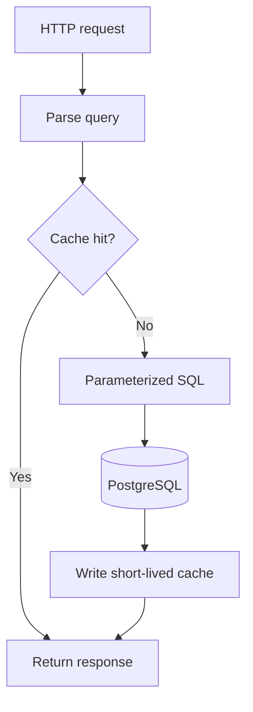

# Search and caching

The read path combines explicit PostgreSQL search queries with a disposable
Redis cache. PostgreSQL defines correctness. Redis only avoids repeated work.

## Query behavior

Search is implemented in `api/src/lib/job.sql.ts`. It uses parameterized raw
SQL for:

- case-insensitive text matching with `ILIKE`;
- optional source, location, company, and employment filters;
- deterministic ordering;
- `LIMIT` and `OFFSET` pagination;
- result counts that match the active filters.

The controller parses pagination values and accepts recognized filter/sort
fields before building SQL. It does **not** currently cap `page` or `limit` to
safe maximum values; that is a documented hardening gap. User-provided values
used by the query are passed as parameters, never interpolated into SQL text.

Prisma remains useful for schema management and conventional CRUD. Raw SQL is
used where the relational query is easier to audit directly. This division is
recorded in [ADR 0001](../decisions/0001-prisma-and-raw-sql.md).

## Ordering and pagination

Results use an explicit sort rather than relying on database row order. Stable
ordering matters because an unspecified order can make records appear to move
between pages even when the data has not changed.

Pagination is offset-based. It is simple and appropriate for the current data
volume, but very deep pages become more expensive and concurrent inserts can
shift page boundaries. Cursor pagination would be the next step if those limits
become visible in production.

The exact parameters and response shapes are in the
[API reference](../reference/api.md).

## Cache-aside behavior

The application checks Redis before a cacheable database read. On a miss it
queries PostgreSQL, returns that result, and stores a serialized copy with a TTL.

| Data | TTL |
|---|---:|
| Job lists and search results | 300 seconds |
| Job detail | 600 seconds |
| Statistics | 1,800 seconds |

Writes invalidate affected keys. Pattern invalidation currently uses Redis
`KEYS`, which is understandable for this project but can block Redis on a large
keyspace. A production-scale implementation should use versioned namespaces,
sets of related keys, or cursor-based `SCAN`.

The cache key must include every parameter that changes a result. Otherwise two
different searches can incorrectly share a response.

## Failure semantics

Redis is non-authoritative, but it is not optional for the current API startup:
`container.connect()` waits for Redis and the server exits when that initial
connection fails. Once the API has started, job cache reads miss safely and
cache writes/invalidation become no-ops when Redis disconnects, so PostgreSQL
still defines read correctness. The standalone scraper also catches an initial
cache connection failure and continues writing to PostgreSQL.

This design also means:

- cached data can be stale until its TTL expires;
- cache warming is opportunistic;
- a restart or flush is safe;
- Redis is not used to recover lost database data.

See [ADR 0003](../decisions/0003-cache-aside-redis.md).

## Operational checks

When search behavior changes:

1. verify the same filters affect rows and the total count;
2. test special characters as SQL parameters;
3. confirm invalid query values return documented errors;
4. compare cached and direct database responses;
5. after a successful API startup, confirm a Redis disconnect still produces a
   valid PostgreSQL-backed response;
6. check that writes invalidate relevant entries.

Use [Testing and debugging](../guides/testing-and-debugging.md) for commands and
failure triage.

## Known limits

- Offset pagination is not ideal for very deep result sets.
- `page` and `limit` are parsed but not bounded to safe maximum values.
- `ILIKE` may require indexes or full-text search as data grows.
- Cache invalidation is broad and uses `KEYS`.
- There is no external cache hit-rate or query-latency dashboard.
- Statistics are eventually consistent within their TTL.
