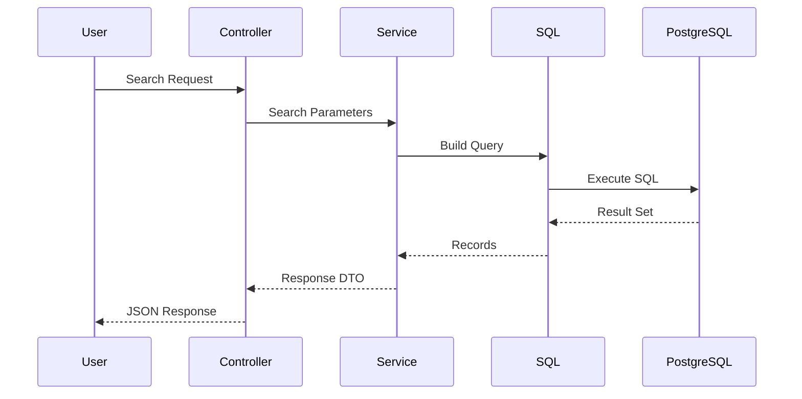

# Search System

## Decision Record

| Field                       | Value                                                                                                                                                     |
| --------------------------- | --------------------------------------------------------------------------------------------------------------------------------------------------------- |
| **Status**                  | Accepted                                                                                                                                                  |
| **Decision**                | Implement the search engine using raw PostgreSQL queries (`pg`) while reserving Prisma ORM for relational domain management.                              |
| **Date**                    | June 2026                                                                                                                                                 |
| **Owner**                   | JobScraper Architecture                                                                                                                                   |
| **Related Components**      | Database Design, Job Service, `job.sql.ts`, Redis Cache                                                                                                   |
| **Alternatives Considered** | Prisma-only search, Query Builders, Elasticsearch, PostgreSQL Full-Text Search                                                                            |
| **Primary Motivation**      | Build flexible, high-performance search queries with dynamic filtering, sorting, and pagination while keeping query generation explicit and maintainable. |

---

# Summary

Searching is the most frequently executed operation in JobScraper.

Unlike authentication or user management, search requests are highly dynamic. A single request may combine multiple optional filters, custom sorting, pagination, and aggregate metadata.

Because of these requirements, the search subsystem is intentionally separated from the remainder of the persistence layer.

Rather than relying entirely on an ORM, JobScraper implements its search engine using handcrafted SQL queries located in **`src/lib/job.sql.ts`**, while the surrounding business logic remains inside **`job.svc.ts`**.

This separation provides explicit control over query generation while preserving a clean service-oriented architecture.

---

# Problem Statement

Search requirements differ significantly from traditional CRUD operations.

Typical search requests may combine:

* Full result pagination
* Source filtering
* Job type filtering
* Location filtering
* Search keywords
* Dynamic sorting
* Date ordering

These combinations produce a large number of possible query permutations.

Generating these efficiently requires explicit control over SQL construction.

---

# Background

Early in the project, search was considered for implementation entirely through Prisma.

While Prisma provides an excellent developer experience for relational CRUD operations, dynamic search queries become increasingly verbose as optional filters grow.

Examples include:

* Conditional WHERE clauses
* Dynamic ORDER BY
* Optional LIMIT/OFFSET
* Aggregate count queries
* Stable pagination

Rather than forcing every query through the ORM abstraction, JobScraper separates search into its own SQL layer.

---

# Design Goals

The search subsystem was designed around several objectives.

## Flexible Filtering

Every filter should be optional.

Combining filters should not require writing separate SQL statements for every possible combination.

---

## Stable Pagination

Pagination should remain deterministic even when new jobs are inserted.

Stable ordering prevents duplicate or skipped results across pages.

---

## Explicit SQL

Generated SQL should remain readable and predictable.

Performance tuning should not depend on ORM-generated queries.

---

## Separation of Responsibilities

Business rules belong in services.

SQL construction belongs in dedicated query modules.

Controllers remain unaware of database implementation details.

---

## Performance

The system should support efficient searching over thousands of job listings without unnecessary database work.

---

# Alternatives Considered

## Prisma Only

Advantages

* Excellent type safety
* Minimal SQL

Disadvantages

* Dynamic query generation becomes increasingly complex
* Harder to optimize generated SQL
* Reduced visibility into execution plans

**Partially Adopted**

---

## Query Builder

Advantages

* More expressive than raw SQL
* Some abstraction

Disadvantages

* Additional dependency
* Less transparent SQL

**Rejected**

---

## Elasticsearch

Advantages

* Advanced search capabilities
* Full-text relevance
* Ranking

Disadvantages

* Additional infrastructure
* Synchronization complexity
* Increased operational cost

**Deferred**

---

## PostgreSQL Full-Text Search

Advantages

* Native database feature
* Improved keyword search

Disadvantages

* Not currently required
* Additional indexing strategy

**Future Enhancement**

---

# Selected Design

Search responsibilities are intentionally divided across multiple layers.

```mermaid
flowchart LR

Frontend

↓

JobController

↓

JobService

↓

job.sql.ts

↓

PostgreSQL
```

Each layer owns a single responsibility.

---

# Architecture

The search system is primarily implemented through two files.

```text
src/services/job.svc.ts

↓

Business Logic

↓

src/lib/job.sql.ts

↓

SQL Generation

↓

PostgreSQL
```

This separation prevents SQL generation from becoming intertwined with application logic.

---

# Why `job.sql.ts` Exists

One of the most important architectural decisions in JobScraper is the introduction of a dedicated SQL module.

Rather than embedding SQL inside services, every query is centralized inside **`job.sql.ts`**.

Its responsibilities include:

* Building search queries
* Constructing WHERE clauses
* Applying sorting
* Pagination
* Aggregate count queries

The module intentionally contains **no business logic**.

Its only responsibility is translating search parameters into SQL.

---

# Why `job.svc.ts` Exists

The service layer sits above the SQL layer.

Responsibilities include:

* Validating search parameters
* Applying application rules
* Coordinating cache usage
* Executing SQL queries
* Transforming database results
* Returning API responses

Because SQL remains isolated, services can evolve without rewriting query generation.

---

# Request Lifecycle

The following sequence illustrates a typical search request.



---

# Dynamic Query Construction

Rather than maintaining dozens of static SQL statements, JobScraper constructs queries dynamically.

Conceptually, the process follows:

```text
Base Query

↓

Optional Filters

↓

Sorting

↓

Pagination

↓

Execution
```

Only the requested filters become part of the final SQL statement.

This keeps queries both flexible and efficient.

---

# Filtering Strategy

Every supported filter is optional.

Examples include:

* Source
* Location
* Job Type
* Keywords
* Posted Date

Because filters are composed dynamically, new filters can be added with minimal changes to the query builder.

---

# Sorting Strategy

The search engine supports multiple ordering strategies while maintaining deterministic results.

Typical ordering includes:

* Newest first
* Oldest first

Stable ordering is essential for reliable pagination.

Without deterministic ordering, newly inserted jobs could produce inconsistent page results.

---

# Pagination

Pagination is implemented at the SQL layer rather than in application memory.

This provides several advantages.

* Reduced memory usage
* Lower network overhead
* Efficient database execution
* Predictable response sizes

Only the requested records are returned to the application.

---

# Performance Considerations

Several architectural decisions improve search performance.

## Database Filtering

Filtering occurs inside PostgreSQL rather than after records are loaded.

---

## Indexed Columns

Frequently queried attributes are indexed to reduce scan time.

---

## SQL-Level Pagination

Pagination avoids loading unnecessary rows into application memory.

---

## Explicit SQL

Handwritten SQL provides predictable execution plans and easier optimization.

---

# Engineering Decisions

## Why Not Use Prisma for Search?

Search queries have different requirements than relational CRUD operations.

Explicit SQL provides greater flexibility while keeping query generation easy to reason about.

---

## Why Separate SQL from Services?

Business logic and SQL evolve independently.

Separating these concerns improves readability, testing, and long-term maintenance.

---

## Why Centralize Query Generation?

Keeping every query inside `job.sql.ts` ensures search behavior remains consistent across the application.

Future optimizations only need to be implemented once.

---

# Trade-offs

Advantages

* Explicit SQL
* Easier optimization
* Better maintainability
* Flexible filtering
* Predictable pagination

Disadvantages

* Additional abstraction layer
* Developers must understand SQL
* Manual query maintenance

These trade-offs were accepted because search represents one of the application's highest-value operations.

---

# Future Improvements

Potential enhancements include:

* PostgreSQL Full-Text Search
* Search ranking
* Materialized views
* Trigram similarity
* Elasticsearch integration
* Hybrid keyword and semantic search
* Vector search for AI-assisted recommendations

---

# Related Documentation

This document describes the search subsystem.

Related architecture documents include:

* Database Design
* Caching
* Backend Architecture
* Job Processing Pipeline
* Engineering Decision: Prisma vs Raw SQL
