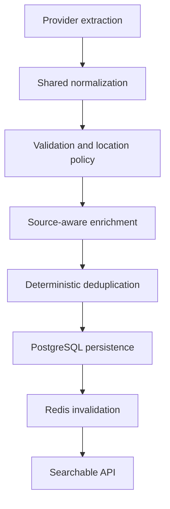

# Case Study: Building JobScraper as a Data-Quality Pipeline

## Project summary

JobScraper collects remote software-engineering vacancies from multiple public job sources and exposes them through an Express API and Next.js interface.

The difficult part was not downloading pages. It was deciding which extracted records were trustworthy enough to persist.

Different sources returned:

- incompatible field names and employment types;
- inconsistent remote-location labels;
- duplicate vacancies under different URLs;
- truncated or missing descriptions;
- authentication pages instead of job content;
- navigation, footer, and “similar jobs” text mixed into descriptions.

Simply storing everything produced a larger dataset, not a reliable one.

## Engineering question

How can multiple fragile sources feed one stable search experience without spreading provider-specific business rules throughout the application?

## System response

The project separates data acquisition from data-quality enforcement:



Provider classes focus on acquiring candidate jobs. `JobProcessor` and `JobService` own the shared rules that decide whether a candidate is accepted, rejected, updated, or counted as a duplicate.

## Decision 1: Normalize before persistence

The processing layer normalizes required fields and rejects records that cannot represent a usable job.

Examples include:

- missing company, position, source, or URL;
- invalid URLs;
- non-job titles such as “Apply now”;
- descriptions that are empty, too short, or dominated by page navigation;
- locations that conflict with the project’s US-remote policy.

The important design choice is that every provider passes through the same quality boundary. Adding a source does not create a new persistence path.

See [Ingestion and data quality](architecture/ingestion-and-data-quality.md).

## Decision 2: Use deterministic business-key deduplication

Provider URLs cannot identify a vacancy across sources. The same role may appear on a company page, a job board, and an aggregator with three different URLs.

JobScraper derives:

```text
companyKey + positionKey + locationKey
```

The application checks for an existing record and PostgreSQL enforces the same composite unique constraint.

This approach is deterministic and inexpensive. It is not fuzzy or meaning-aware: variations such as “Software Engineer” and “Software Developer” remain different unless their normalized keys match.

See [ADR 0002](decisions/0002-deterministic-deduplication.md).

## Decision 3: Enrich descriptions selectively

Some API/RSS sources already return usable descriptions. Other sources require a detail-page request.

`job.processor.ts` defines source-specific policies for:

- whether enrichment is enabled;
- enrichment concurrency;
- maximum jobs enriched per run;
- retry attempts;
- minimum description quality.

This avoids paying the browser/network cost for sources that already provide good content, while still protecting persistence from authentication walls and page-wrapper noise.

## Decision 4: Keep search explicit

Search, filtering, sorting, pagination, and aggregate statistics use
parameterized SQL in `api/src/lib/job.sql.ts`. Relational CRUD uses Prisma.

This gives the dynamic query path an explicit SQL contract without giving up Prisma’s type-safe relations and CRUD operations.

Current search uses leading-wildcard `ILIKE`, not PostgreSQL full-text search or trigram indexes. It is appropriate for the current portfolio dataset but should not be described as proven high-performance search.

See [Search and caching](architecture/search-and-caching.md).

## Decision 5: Treat Redis as disposable

Job lists, job details, and statistics use cache-aside Redis entries:

| Data | TTL |
| --- | ---: |
| Filtered job lists | 5 minutes |
| Job details | 10 minutes |
| Statistics | 30 minutes |

PostgreSQL remains the source of truth. After a successful API startup, cache
operation failures degrade job reads to database queries and successful writes
invalidate related key families. The current API bootstrap still requires an
initial Redis connection; the standalone scraper handles Redis as optional.

The current invalidation implementation uses Redis `KEYS`, which is acceptable only for the project’s small keyspace. It must be replaced before claiming large-keyspace scalability.

## Authentication and user features

The Express API verifies credentials with bcrypt and issues a 24-hour backend JWT. NextAuth Credentials calls that API and stores the backend token inside a 24-hour frontend JWT session.

Saved jobs require authentication. Administrative routes require both authentication and membership in the `ADMIN_EMAILS` allowlist.

See [Authentication](architecture/authentication.md).

## Verification

The Phase 1 codebase was verified with:

- 17 backend test files;
- 126 passing backend tests;
- a successful backend TypeScript compiler check (`tsc --noEmit`);
- a successful Next.js production build.

The tests cover controllers, services, SQL construction, job processing, scraper regressions, saved jobs, authentication, administrative authorization, health, statistics, and route wiring.

The [verification evidence](evidence/verification.md) connects these claims to
specific tests and commits, records a sanitized historical scrape summary, and
states the limits of the included microbenchmark.

## Capability status

| Status | Capability | Boundary |
|---|---|---|
| Implemented | Eight default provider adapters | External markup can still change |
| Implemented | Shared validation and source-aware description handling | English-focused heuristics |
| Implemented | Database-enforced deterministic deduplication | No fuzzy company/title resolution |
| Implemented | Parameterized search, filtering, ordering, and pagination | Leading-wildcard `ILIKE`; no search benchmark |
| Implemented | Redis cache-aside reads and invalidation | Broad invalidation uses `KEYS` |
| Implemented | Registration, login, saved jobs, and admin allowlist | No refresh, password reset, MFA, or rate limiting |
| Implemented | Daily process-local scheduler | No durable queue or distributed lock |
| Experimental | NoDesk adapter | Disabled unless explicitly enabled |
| Planned | Durable queued scraper execution | Not implemented |
| Planned | Full-text or trigram-backed search | Not implemented |
| Planned | Versioned or cursor-based cache invalidation | Not implemented |
| Planned | Rate limiting and a token-refresh strategy | Not implemented |

## Current outcome

- Nine implemented provider adapters: eight run by default, while NoDesk is
  experimental and disabled by default.
- One shared processing path for normalization, filtering, enrichment, persistence, and metrics.
- Database-enforced duplicate protection.
- Per-source execution and data-quality summaries.
- Cached filtered search and saved-job workflows.
- Protected administrative scraping and cache endpoints.

## Honest limitations

- Providers execute sequentially.
- The scheduler and API share one Node.js process.
- Scheduling is process-local and runs once daily at `02:00` in the process timezone.
- The overlap guard is in-memory, not distributed.
- Manual scraping is a long-running HTTP request.
- Search uses leading-wildcard `ILIKE`.
- Pagination values are parsed but not capped to safe maximums.
- Cache invalidation uses Redis `KEYS`.
- There is no API rate limiting.
- Authentication has no refresh-token, password-reset, or email-verification flow.
- Provider terms, request policies, and `robots.txt` behavior must be reviewed before operating a scraper against any source.

## What this project demonstrates

The strongest engineering signal is not the number of technologies used. It is the progression from source-specific scraping toward explicit system boundaries:

- external data is treated as untrusted;
- shared rules are centralized;
- duplicate protection is enforced at the database boundary;
- cache failure does not redefine the source of truth;
- limitations are documented instead of hidden behind “production-grade” language.

## Continue reading

- [Architecture overview](architecture/overview.md)
- [Adding a provider](guides/adding-a-provider.md)
- [Description quality engineering note](engineering-notes/description-quality.md)
- [Cross-source deduplication engineering note](engineering-notes/cross-source-deduplication.md)
- [Standalone scraper dependency-container note](engineering-notes/standalone-scraper-dependency-container.md)
