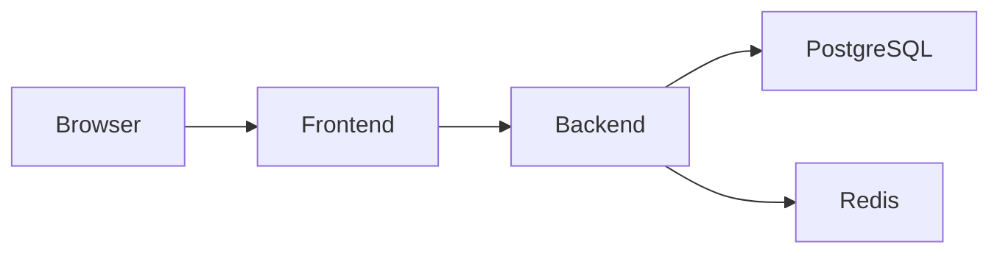

# Docker Guide

## Before You Begin

| Item               | Value                                                                     |
| ------------------ | ------------------------------------------------------------------------- |
| **Estimated Time** | 10–15 minutes                                                             |
| **Difficulty**     | Beginner                                                                  |
| **Prerequisites**  | Docker Engine or Docker Desktop, Docker Compose                           |
| **Outcome**        | A fully containerized JobScraper development environment running locally. |

---

# Overview

JobScraper includes a complete Docker development environment that allows the entire application stack to run consistently across different operating systems.

The Docker configuration eliminates the need to manually install PostgreSQL or Redis on the host machine and provides an isolated environment for local development.

The stack consists of four primary services:

* Frontend
* Backend API
* PostgreSQL
* Redis

All services communicate through an isolated Docker network.

---

# Why Docker?

Without Docker, every developer must manually configure:

* PostgreSQL
* Redis
* Node.js runtime
* Environment variables
* Network configuration

Docker provides:

* Consistent environments
* Simplified onboarding
* Dependency isolation
* Reproducible development

The application behaves identically across development machines.

---

# Container Architecture

The local development environment consists of the following containers.



Each service has a clearly defined responsibility.

---

# Services

## Frontend

Responsibilities:

* Next.js application
* User interface
* API communication

Default Port

```text
3000
```

---

## Backend

Responsibilities:

* REST API
* Scraper execution
* Authentication
* Search
* Scheduler

Default Port

```text
3001
```

---

## PostgreSQL

Responsibilities:

* Persistent application data
* Authentication
* Jobs
* Saved jobs

Default Port

```text
5432
```

---

## Redis

Responsibilities:

* Search caching
* Performance optimization

Default Port

```text
6379
```

---

# Project Structure

```text
JobScraper/

docker-compose.yml

api/

Dockerfile

frontend/

Dockerfile
```

Each application maintains its own Dockerfile while orchestration is handled by `docker-compose.yml`.

---

# Build the Containers

From the project root:

```bash
docker compose build
```

This builds every container defined within the compose configuration.

---

# Start the Stack

```bash
docker compose up
```

Run in detached mode:

```bash
docker compose up -d
```

Docker will start:

* PostgreSQL
* Redis
* Backend
* Frontend

---

# Stop the Stack

```bash
docker compose down
```

Containers are stopped while persistent volumes remain intact.

---

# Rebuild After Code Changes

When Dockerfiles change:

```bash
docker compose up --build
```

For a clean rebuild:

```bash
docker compose build --no-cache
```

---

# View Running Containers

```bash
docker compose ps
```

Example output:

```text
frontend

api

postgres

redis
```

---

# View Logs

Entire application:

```bash
docker compose logs
```

Specific service:

```bash
docker compose logs api
```

Follow logs:

```bash
docker compose logs -f api
```

---

# Execute Commands Inside Containers

Backend:

```bash
docker compose exec api bash
```

Frontend:

```bash
docker compose exec frontend sh
```

Database:

```bash
docker compose exec postgres psql
```

---

# Run the Scraper

Execute a scraping cycle:

```bash
docker compose exec api npm run scrape
```

The scraper executes exactly as it would outside Docker.

---

# Prisma Commands

Generate Prisma Client:

```bash
docker compose exec api npx prisma generate
```

Run migrations:

```bash
docker compose exec api npx prisma migrate deploy
```

Development migrations:

```bash
docker compose exec api npx prisma migrate dev
```

Open Prisma Studio:

```bash
docker compose exec api npx prisma studio
```

---

# Restart a Service

Restart backend only:

```bash
docker compose restart api
```

Restart Redis:

```bash
docker compose restart redis
```

Restart PostgreSQL:

```bash
docker compose restart postgres
```

---

# Remove Containers

Stop containers:

```bash
docker compose down
```

Remove volumes:

```bash
docker compose down -v
```

Use with caution.

Removing volumes deletes local database data.

---

# Development Workflow

Typical Docker workflow:

```text
Pull Changes

↓

docker compose build

↓

docker compose up

↓

Run Scraper

↓

Develop

↓

Run Tests

↓

docker compose down
```

---

# Troubleshooting

## Backend Cannot Connect to PostgreSQL

Verify:

* PostgreSQL container is running.
* Environment variables reference the Docker service name rather than `localhost`.
* Containers share the same Docker network.

---

## Redis Connection Failed

Verify:

* Redis container is running.
* Backend configuration references the Redis service name.
* Redis has finished starting before the backend attempts to connect.

---

## Changes Not Appearing

Possible causes:

* Browser cache
* Container not rebuilt
* Mounted volume configuration
* Next.js development cache

Try:

```bash
docker compose up --build
```

---

## Prisma Migration Fails

Verify:

* PostgreSQL container is healthy.
* Existing migrations are valid.
* Database volume is not corrupted.

---

## Scraper Produces No Jobs

Possible causes include:

* Provider website changes
* Temporary network issues
* Rate limiting
* Invalid configuration

Review backend logs for provider summaries and warning messages.

---

# Best Practices

* Rebuild containers after modifying Dockerfiles.
* Keep Docker Compose configuration under version control.
* Avoid storing secrets inside images.
* Use named volumes for persistent data.
* Execute Prisma commands inside the backend container.
* Verify health before running scraping jobs.

---

# Related Documentation

For additional information, see:

* Local Development Guide
* Architecture Overview
* Scheduler
* Monitoring
* Database Design
* Prisma Migrations Guide
