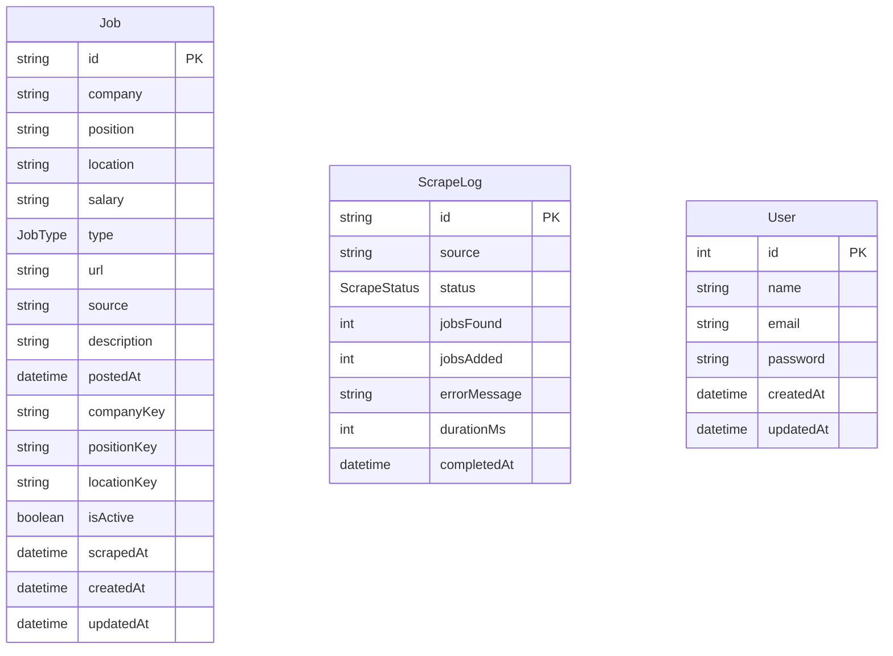

# Database Schema Reference

## Overview

JobScraper stores persistent application data in PostgreSQL using Prisma ORM.

The current schema consists of:

* 3 Models
* 2 Enums
* Multiple indexes
* Composite uniqueness constraints

The schema is defined in:

```text
api/prisma/schema.prisma
```

---

# Schema Summary

| Type                         | Count |
| ---------------------------- | ----: |
| Models                       |     3 |
| Enums                        |     2 |
| Composite Unique Constraints |     1 |
| Secondary Indexes            |     9 |

---

# Entity Relationship Diagram



---

# Models

---

# Job

Represents a normalized job listing collected from an external provider.

## Purpose

The `Job` model is the central entity of the application.

It stores every validated job that successfully passes the processing pipeline.

---

## Fields

| Field         | Type     | Required | Default               | Description                     |
| ------------- | -------- | -------- | --------------------- | ------------------------------- |
| `id`          | String   | Yes      | UUID                  | Primary key.                    |
| `company`     | String   | Yes      | —                     | Company name.                   |
| `position`    | String   | Yes      | —                     | Job title.                      |
| `location`    | String?  | No       | `NULL`                | Job location.                   |
| `salary`      | String?  | No       | `NULL`                | Salary information.             |
| `type`        | JobType  | Yes      | `FULL_TIME`           | Employment type.                |
| `url`         | String   | Yes      | —                     | Original provider URL.          |
| `source`      | String   | Yes      | —                     | Provider name.                  |
| `description` | String?  | No       | Empty string          | Job description.                |
| `postedAt`    | DateTime | Yes      | Current time          | Original posting date.          |
| `companyKey`  | String   | Yes      | —                     | Normalized company identifier.  |
| `positionKey` | String   | Yes      | —                     | Normalized position identifier. |
| `locationKey` | String   | Yes      | —                     | Normalized location identifier. |
| `isActive`    | Boolean  | Yes      | `true`                | Active listing flag.            |
| `scrapedAt`   | DateTime | Yes      | Current time          | Last scrape timestamp.          |
| `createdAt`   | DateTime | Yes      | Current time          | Record creation timestamp.      |
| `updatedAt`   | DateTime | Yes      | Automatically updated | Last modification timestamp.    |

---

## Primary Key

```text
id
```

---

## Composite Unique Constraint

```text
(companyKey, positionKey, locationKey)
```

This constraint implements semantic deduplication by preventing multiple records that represent the same logical job from being stored.

---

## Indexes

| Index         |
| ------------- |
| `source`      |
| `createdAt`   |
| `isActive`    |
| `companyKey`  |
| `positionKey` |
| `locationKey` |

These indexes optimize the application's most common filtering and lookup operations.

---

# ScrapeLog

Represents the result of an individual scraping execution.

---

## Purpose

Stores operational information about completed scraping runs.

This model supports monitoring, diagnostics, and historical execution analysis.

---

## Fields

| Field          | Type         | Required | Default      | Description                         |
| -------------- | ------------ | -------- | ------------ | ----------------------------------- |
| `id`           | String       | Yes      | UUID         | Primary key.                        |
| `source`       | String       | Yes      | —            | Provider name.                      |
| `status`       | ScrapeStatus | Yes      | —            | Execution outcome.                  |
| `jobsFound`    | Int          | Yes      | —            | Number of jobs discovered.          |
| `jobsAdded`    | Int          | Yes      | —            | Number of new jobs persisted.       |
| `errorMessage` | String?      | No       | `NULL`       | Execution error message.            |
| `durationMs`   | Int          | Yes      | —            | Execution duration in milliseconds. |
| `completedAt`  | DateTime     | Yes      | Current time | Completion timestamp.               |

---

## Primary Key

```text
id
```

---

## Indexes

| Index         |
| ------------- |
| `source`      |
| `status`      |
| `completedAt` |

These indexes support provider-specific reporting and historical monitoring queries.

---

# User

Represents an authenticated user of the application.

---

## Purpose

Stores application users and supports authenticated features such as user accounts and saved jobs.

---

## Fields

| Field        | Type     | Required | Default               | Description                                        |
| ------------ | -------- | -------- | --------------------- | -------------------------------------------------- |
| `id`         | Int      | Yes      | Auto Increment        | Primary key.                                       |
| `name`       | String   | Yes      | —                     | User's display name.                               |
| `email`      | String   | Yes      | —                     | Unique email address.                              |
| `password`   | String   | Yes      | —                     | Password hash.                                     |
| `createdAt`  | DateTime | Yes      | Current time          | Account creation timestamp (`created_at` column).  |
| `updated_at` | DateTime | Yes      | Automatically updated | Last modification timestamp (`updated_at` column). |

---

## Primary Key

```text
id
```

---

## Unique Constraints

| Constraint |
| ---------- |
| `email`    |

Email addresses must be unique across all users.

---

## Table Mapping

The Prisma model maps to the database table:

```text
users
```

Timestamp columns are mapped to:

```text
created_at

updated_at
```

---

# Enums

---

# JobType

Represents the supported employment types.

| Value        |
| ------------ |
| `FULL_TIME`  |
| `PART_TIME`  |
| `CONTRACT`   |
| `INTERNSHIP` |

The default value is:

```text
FULL_TIME
```

---

# ScrapeStatus

Represents the outcome of a scraping execution.

| Value     |
| --------- |
| `SUCCESS` |
| `FAILED`  |

---

# Default Values

The schema defines the following automatic defaults.

| Field                   | Default               |
| ----------------------- | --------------------- |
| `Job.id`                | UUID                  |
| `Job.type`              | `FULL_TIME`           |
| `Job.description`       | Empty string          |
| `Job.postedAt`          | Current timestamp     |
| `Job.isActive`          | `true`                |
| `Job.scrapedAt`         | Current timestamp     |
| `Job.createdAt`         | Current timestamp     |
| `Job.updatedAt`         | Automatically updated |
| `ScrapeLog.id`          | UUID                  |
| `ScrapeLog.completedAt` | Current timestamp     |
| `User.id`               | Auto Increment        |
| `User.createdAt`        | Current timestamp     |
| `User.updated_at`       | Automatically updated |

---

# Naming Conventions

The schema follows these conventions:

* Models use **PascalCase**.
* Fields use **camelCase**.
* Database-specific names are introduced only where necessary using `@map` and `@@map`.
* UUIDs are used for application entities (`Job`, `ScrapeLog`).
* Auto-incrementing integers are used for user identities.

---

# Schema Evolution

Database changes should always be introduced through Prisma migrations.

Do not modify the database schema manually.

See:

```text
docs/guides/prisma-migrations.md
```

for the recommended workflow.

---

# Related Documentation

* Database Design
* Search System
* Semantic Deduplication
* Authentication Architecture
* Prisma Migrations Guide
* Environment Variables Reference
